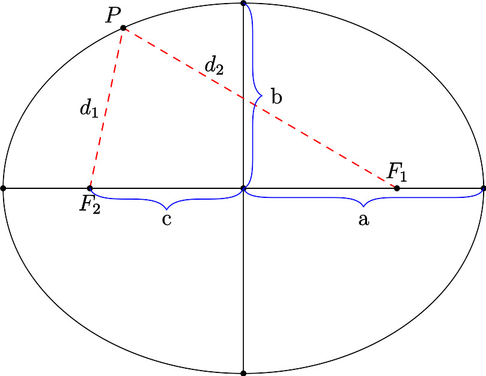

# The Ellipse

The ellipse is, geometrically, a circle that has been stretched in the $x$ and/or $y$ directions. It has useful
reflection properties and is most famous, perhaps, for defining the shape of a closed orbit in a 2-body orbital system.

**Geometric Definition**: Given two fixed points in a plane, $F_1$ and $F_2$, and a constant $k > 0$, the ellipse is the locus of points $P$ in the same plane such that $||PF_1| + ||PF_2|| = k$. The line through $F_1$ and $F_2$ is the *major axis* of the ellipse. The two points $F_1,F_2$ are the *foci* (singular: *focus*) of the ellipse. The *minor axis* is perpendicular to the major axis. The 4 points at which the ellipse intersects an axis are the vertices.

{width=2in}

**Parent Equation**: $\dfrac{x^2}{a^2}+\dfrac{y^2}{b^2}=1$ is the equation for an ellipse centered at the origin. The semi-major axis length is $\max(a,b)$ and the semi-minor axis length is $\min(a,b)$. (The major and minor axis lengths are twice the semi-major axis and semi-minor axis lengths.)

**General Equation**: $\dfrac{(x-h)^2}{a^2} + \dfrac{(y-k)^2}{b^2} = 1$ is an ellipse centered at $(h,k)$.

**Properties**

* Length of axes are $2a$ and $2b$. The longer one is the major axis.
* The distance from the center of the ellipse to either focus is $c$ where $c^2 = |a^2-b^2|$.
* The sum of the distances from any point to both foci is $\max(2a,2b)$
* The eccentricity of an ellipse is defined as $e = \dfrac{c}{a}$.
* The area of an ellipse is $\pi a b$.
* The perimeter of an ellipse is very complicated[^1]
* Any ray of light or sound which emanates from one focus will reflect to the other focus. You may have experienced this in the US Capitol's Whispering Gallery.

**Relation to a circle**. A circle is an ellipse with $a=b$. You can think of $a$ as the "x-radius" of the ellipse and $b$ as the "y-radius" of the ellipse. (These are not widely accepted terms, just mental aids).

<!---
**Parametric Equations**. An ellipse can be defined parametrically as the set of points $x = a \cos \theta, y = b \sin \theta$ for $\theta \in [0,2\pi)$. These equations trace the ellipse counterclockwise starting at the point $(b,0).$ Transforming these equations to a center of $(h,k)$ results in $x = h + a \cos \theta, y = k + b \sin \theta$.

**Polar Equation:** The polar equation for an ellipse is ...
--->

(Note: this presentation differs from many texts which enforce that $a>b$ leading two 2 version of every equation and definition, one for tall ellipses and one for wide ellipses. This is silly. It's easier to say $a$ always goes with $x$ and the major axis goes with whichever of $a,b$ is larger.)

## Problems

#. Match the following

  #. $\dfrac{x^2}{4}+\dfrac{y^2}{9} = 1$
  #. $\dfrac{x^2}{9}+\dfrac{y^2}{4} = 1$
  #. $\dfrac{(x-2)^2}{16} + (y+1)^2 = 1$
  #. $\dfrac{(x+2)^2}{9}+\dfrac{(y+2)^2}{4} = 1$

	{width=1.5in}
	{width=1.5in}
	{width=1in}
	{width=1.5in}

1. Find the equation of an ellipse in standard form, centered at the origin with
   #.  Major axis of length 12, minor axis of length 6
   #.  Passes through the points $(0,6)$ and $(3,0)$
   #.  Foci: $(\pm 4,0)$, major axis 10
   #.  Vertices: $(\pm 7,0)$, foci: $(\pm 2,0)$
   #.  Vertices: $(0, \pm 8)$, foci: $(0, \pm 4)$
#. Find the equation of an ellipse in standard form
   #. Vertices: $(2,0), (10,0)$; minor axis length 4
   #. Foci: $(0,0), (4,0)$, major axis length 6
   #. Center: $(2,-1)$, vertex $(2,\frac12)$,minor axis length 2
#. Find the center, vertices, foci, eccentricity and sketch
   #. $\dfrac{x^2}{25} + \dfrac{y^2}{16} = 1$
   #. $\dfrac{x^2}{16} + \dfrac{y^2}{81} = 1$
   #. $\dfrac{(x-4)^2}{16} + \dfrac{(y+1)^2}{25} = 1$
   #. $\dfrac{(x-5)^2}{9/4} + (y-1)^2 = 1$
   #. $9x^2 + 4y^2 + 36x - 24y + 36 = 0$
   #. $12x^2 + 20y^2 - 12x + 40y - 37 = 0$
#. Find the equation of an ellipse with vertices $(\pm 5,0)$ and eccentricity $e = \dfrac{4}{5}$.
#.  Statuary Hall is an elliptical room in the United States Capitol in Washington, D.C. The room is also called the Whispering Gallery because a person standing at one focus of the room can hear even a whisper spoken by a person standing at the other focus. The dimensions of Statuary Hall are 46 feet wide by 97 feet long.
    #.  Find an equation of the shape of the room.
    #.  Determine the distance between the foci.
#.  The first artificial satellite to orbit Earth was Sputnik I (launched by the former Soviet Union in 1957). Its highest point above Earth’s surface was 939 kilometers, and its lowest point was 215 kilometers (see figure). The center of Earth was at one focus of the elliptical orbit. Find the eccentricity of the orbit. (Assume the radius of Earth is 6378 kilometers.)
#. Find an equation of an ellipse such that for any point $P$ on the ellipse, the sum of the distances from the point $P$ to the points $(2, 2)$ and $(10, 2)$ is 36.
#. How many ellipses centered at the origin contain the points $(1,1)$ and $(1,-1)$?
#. Find all solutions to the previous problem.
#. Write the formula for eccentricity using only $a$ and $b$. Analyze the limits as $a \to b$ and as $a \to \infty$.
#. Orbital mechanics:
    #. The Earth orbits the sun in an (approximately[^2]) elliptical orbit with the Sun at one focus. This is Kepler's Law. The average from the sun to the earth is defined as one astronomical units (AUs). Since the distance varies, there is a point when the earth is closest to the sun (perihelion) and furthest (aphelion).
    #. Using a reliable resource, determine the values of the distances at aphelion and perihelion for the Earth in AU.
    #. Using these value, write the equation of the Earth's orbit in standard form, where $x$ and $y$ are measured in units of AU. Assume the Sun is positioned to the right of the center of the ellipse, on the $x$-axis.

1.  Confocal ellipses have the same foci. Show that, for  $k>0$, all ellipses of the form  $\dfrac{x^2}{6+k}+\dfrac{y^2}{k}=1$ are confocal.

#. A square is inscribed inside an ellipse with major axis length 5 and minor axis length 4. What is the area of the square? (*Inscribed* means the vertices of the square are on the ellipse).

#. The ellipse $E$ has vertices at $(\pm 6,0)$ and $(0, \pm 4)$.
	#

	----------------------------------------------------- ----------------------------------------
	  {width=1in}     The line $y=4$ is tangent to the
																													ellipse at point $P = (0,4)$. The
																													angles $\alpha$ and $\beta$ are the
																														same in Figure 3. Find $\alpha$.

	----------------------------------------------------- ----------------------------------------

	#. 	{width=2in}
Let $Q$ be the point on $E$ in the first quadrant with $x$-coordinate 2. The tangent line at $Q$ also makes equivalent angles with the lines from $Q$ to the two foci. Find the equation of the tangent line.
	#. Find the coordinate in the first quadrant at which the tangent line makes a $30^\circ$ angle with the lines to the foci.
	#. What is the maximum angle the tangent line makes with the lines to the foci?

#. Derive the parent equation of an ellipse from its parametric equations.

#. Derive the parent equation of an ellipse from its geometric definition.

[^1]: If you really want to know, it's the value of the "complete elliptic integral of the second kind" $4a \int_0^{\pi/2} \sqrt{1 - e^2 \sin^2 \theta} \; d\theta$, which can be approximated by the series $p = \pi(a+b)\left(1 + \frac14 h + \frac{1}{64}h^2 + \frac{1}{256}h^3 + \ldots\right)$ where $h = \frac{(a-b)^2}{(a+b)^2}$
[^2]: It would be a perfect ellipse if it weren't for the moon, and Jupiter and, to a much smaller extent, all the other planets.

---
geometry: margin=1in
header-includes:
- |
  \let\oldsection\section
  \renewcommand{\section}[1]{\clearpage\oldsection{#1}}
	\def\tightlist{}
---
