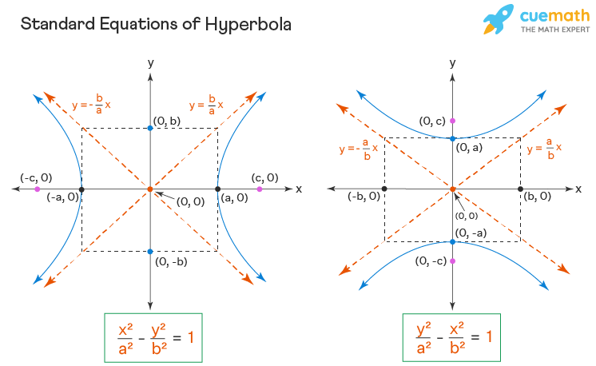
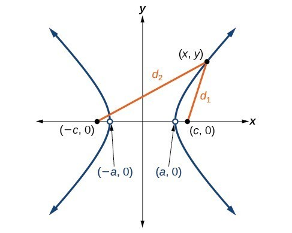

# The Hyperbola

The hyperbola is the only conic section that has two pieces. Graphically, it's not
unlike an "exploded ellipse" and its equations are all very similar to ellipse equations. Hyperbolic orbits occur in the solar system when an object has enough velocity to escape the sun's gravity. Some known comets have hyperbolic trajectories, meaning they will orbit the sun only once and then leave forever. Hyperbolas can also be used to define trigonometric functions in the same way as the circle; these are called hyperbolic trig functions.

**Geometric Definition**: Given two fixed points in a plane, $F_1$ and $F_2$, and a constant $k > 0$, the hyperbola is the locus of points $P$ in the same plane such that $| d_1 - d_2 | = k$. The line through $F_1$ and $F_2$ is the *transverse axis* of the hyperbola. The line perpendicular to the transverse and through the midpoint of $F_1F_2$ is the *conjugate axis*. The two points $F_1,F_2$ are the *foci* (singular: *focus*) of the hyperbola. The 2 points at which the hyperbola intersects the transverse axis are the vertices.

<centering>
{height=3in}
{height=2in}
</centering>

**Parent Equation**: $\dfrac{x^2}{a^2}-\dfrac{y^2}{b^2}=1$ is the equation for a horizontal hyperbola centered at the origin. This hyperbola opens to the left and the right.

**Standard Form**:

  * $\dfrac{(x-h)^2}{a^2} - \dfrac{(y-k)^2}{b^2} = 1$ is a horizontal hyperbola centered at $(h,k)$.
  * $\dfrac{(y-k)^2}{a^2} - \dfrac{(x-h)^2}{b^2} = 1$ is a vertical hyperbola centered at $(h,k)$.

**Properties**

* The *transverse axis* is the axis of symmetry that intersects the hyperbola. It has a length of $2a$ and intersects the hyperbola at the vertices.
* The *conjugate axis* is the line of symmetry perpendicular to the transverse axis. It has a length of $2b$. It does not intersect the hyperbola but its endpoints are called *co-vertices*.
* The distance from the center to a focus is $c = \sqrt{a^2+b^2}$
* The foci are on the transverse axis and the distance between them is $2c$.
* The difference between  the distances from any point on a hyperbola to both foci is $2a$
* The eccentricity of a hyperbola is defined as $e = \dfrac{c}{a}$.
* The asymptotes of a horizontal hyperbola are $(y-k) = \pm \dfrac{b}{a}(x-h)$ and a vertical hyperbola are
$(y-k) = \pm \dfrac{a}{b}(x-h)$. You don't have to remember this if you follow the instructions in the next paragraph.

**How to draw a hyperbola**. Draw an ellipse first! (Pretend the minus is a plus). Draw a rectangle around the ellipse and lightly sketch the diagonals, extending to infinity. These are the asymptotes of your parabola. Determine if the hyperbola opens along the $x$ or $y$ axis (which term is positive in the equation?). Place the vertices on the edge of the rectangle intersecting the transverse axis and draw the hyperbola through the vertices and approaching the asymptotes. Done! Now you can add the foci and co-vertices.

## Exercises

### Fundamental Concepts

1. Find the standard form of the equation of the hyperbola with the given characteristics:
   1. Vertices: $(0, \pm 2)$; foci $(0, \pm 4)$
   2. Vertices: $(2,0), (6,0)$; foci $(0,0), (8,0)$
   3. Vertices: $(4,1), (4,9)$; foci $(4,0), (4,10)$
   4. Vertices $(2,3),(2,-3)$; passes through $(0,5)$
2. Find the center, vertices, foci. Sketch the hyperbola and its asymptotes
   1. $x^2-y^2 = 1$
   2. $\dfrac{y^2}{36} - \dfrac{x^2}{100} = 1$
   3. $\dfrac{(x-1)^2}{4} - \dfrac{(y+2)^2}{1} = 1$
   4. $9x^2 - y^2 - 36x - 6y + 18 = 0$
3. For the previous problem, write the equations of the asymptotes of the hyperbolas, for each of the 4 given hyperbolas.
4. Write the standard form of the equation of the hyperbola with the given characteristics:
   1. Vertices: $(\pm 1, 0)$; asymptotes: $y = \pm 5x$
   2. Vertices: $(3, 0), (3, 4)$; asymptotes: $y = \frac23 x$, $y = 4 - \frac23 x$
5. Write in general form: $\dfrac{(x-1)^2}{4} + \dfrac{(y+2)^2}{1} = 1$

### Deeper Understanding

6. **Echolocation** You and a friend live 4 miles apart. You hear a clap of thunder from lightning 18 seconds before your friend hears it. Using this you can write an equation of a hyperbola -- the thunder originated somewhere on one branch of this hyperbola. Write an equation using miles as the unit. (Assume sound travels at 1100 feet per
second.)
6. **I'm one over you.** Plot a graph of $y=\dfrac{1}{x}$. This is a special type of hyperbola called a *rectangular hyperbola* but you may know it best as just a reciprocal function. What are the lengths of the axes of this hyperbola and where are its foci?
8. **Computer graphing.** Using Desmos, plot the following system: $x(t) = \cos(t), y(t) = \sin(t)$. (It can be entered like an ordered pair: $(\cos(t), \sin(t))$ and enter the domain $0 \leq t \leq 2\pi$.) What is this a graph of? Explain why it looks like this? Use a Pythagorean identity to write this system as a conic section in standard form.
9. **Computer graphing.** Repeat the previous problem with $x(t) = \sec(t), y(t) = \tan(t)$. (You will need to tweak the domain of $t$) Describe the graph and write the equation as a conic section using trig.
9. **Proofs and derivations.** Prove the asymptotes of a hyperbola centered at the origin are given by the formula stated above. (Solve for $y$ and take a limit).
10. **Proofs and derivations.** Prove the difference between the distances from any point on a hyperbola to the two foci is equal to $2a$.
11. **Proofs and derivations.** Prove $c^2 = a^2+b^2$ in a hyperbola.
6. **Bullseye** Reread the thunder question. You have another friend who happens to live exactly halfway between you and your 4-mile away friend. This friend hears the thunder exactly 8 seconds after you do. Set up a system of equations to determine precisely where the thunder originated. Solve the system and discuss.
14. **It's not "discriminate"**. The *discriminant* $\Delta$ of a conic section equation in general form: $Ax^2 + Bxy + Cy^2 + Dx + Ey + F = 0$ is given by $\Delta = B^2 - 4AC$. So far we have only considered $B=0$ so it's simpler: $\Delta = -4AC$. Can you derive a rule for $\Delta$ that allows you to determine if the conic given is a circle, ellipse or hyperbola?

---
geometry: margin=1in
header-includes:
- |
  \let\oldsection\section
  \renewcommand{\section}[1]{\clearpage\oldsection{#1}}
	\def\tightlist{}
---
