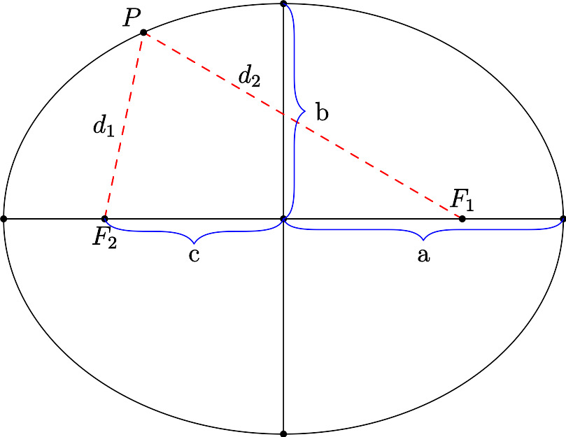

# The Hyperbola

The hyperbola is the only conic section that has two pieces. Graphically, it's not
unlike an "exploded ellipse" and its equations are all very similar to ellipse equations. Hyperbolic orbits occur in the solar system when an object has enough velocity to escape the sun's gravity. Many known comets have hyperbolic trajectories, meaning they will orbit the sun only once and then leave forever. Hyperbolas can also be used to define trigonometric functions in the same way the circle; these are called hyperbolic trig functions.

**Geometric Definition**: Given two fixed points in a plane, $F_1$ and $F_2$, and a constant $k > 0$, the hyperbola is the locus of points $P$ in the same plane such that $| d_1 - d_2 | = k$. The line through $F_1$ and $F_2$ is the *major axis* of the hyperbola. The two points $F_1,F_2$ are the *foci* (singular: *focus*) of the ellipse. The *minor axis* is perpendicular to the major axis. The 2 points at which the ellipse intersects an axis are the vertices.

{width=2in}

**Parent Equation**: $\dfrac{x^2}{a^2}+\dfrac{y^2}{b^2}=1$ is the equation for an ellipse centered at the origin. The semi-major axis length is $\max(a,b)$ and the semi-minor axis length is $\min(a,b)$.

**General Equation**: $\dfrac{(x-h)^2}{a^2} + \dfrac{(y-k)^2}{b^2} = 1$ is an ellipse centered at $(h,k)$.

**Properties**

* Length of axes are $2a$ and $2b$. The longer one is the major axis.
* The distance from the center to either focus is $c$ where $c^2 = |a^2-b^2|$.
* The sum of the distances from any point to both foci is $\max(2a,2b)$
* The eccentricity of an ellipse is defined as $e = \dfrac{c}{a}$.
* The area of an ellipse is $\pi a b$.
* The perimeter of an ellipse is very complicated[^1]
* Any ray of light or sound which emanates from one focus will reflect to the other focus. You may have experienced this in the US Capitol's Whispering Gallery.

**Relation to a circle**. A circle is an ellipse with $a=b$. You can think of $a$ as the "x-radius" of the ellipse and $b$ as the "y-radius" of the ellipse. (These are not widely accepted terms, just mental aids).

**Parametric Equations**. An ellipse can be defined parametrically as the set of points $x = a \cos \theta, y = b \sin \theta$ for $\theta \in [0,2\pi)$. These equations trace the ellipse counterclockwise starting at the point $(b,0).$ Transforming these equations to a center of $(h,k)$ results in $x = h + a \cos \theta, y = k + b \sin \theta$.

**Polar Equation:** The polar equation for an ellipse is ...

(Note: this presentation differs from many texts which enforce that $a>b$ so there are 2 version of every equation and definition. This is silly. It's easier to say $a$ always goes with $x$ and the major axis goes with whichever of $a,b$ is larger.)

---
geometry: margin=1in
header-includes:
- |
  \let\oldsection\section
  \renewcommand{\section}[1]{\clearpage\oldsection{#1}}
	\def\tightlist{}
---
