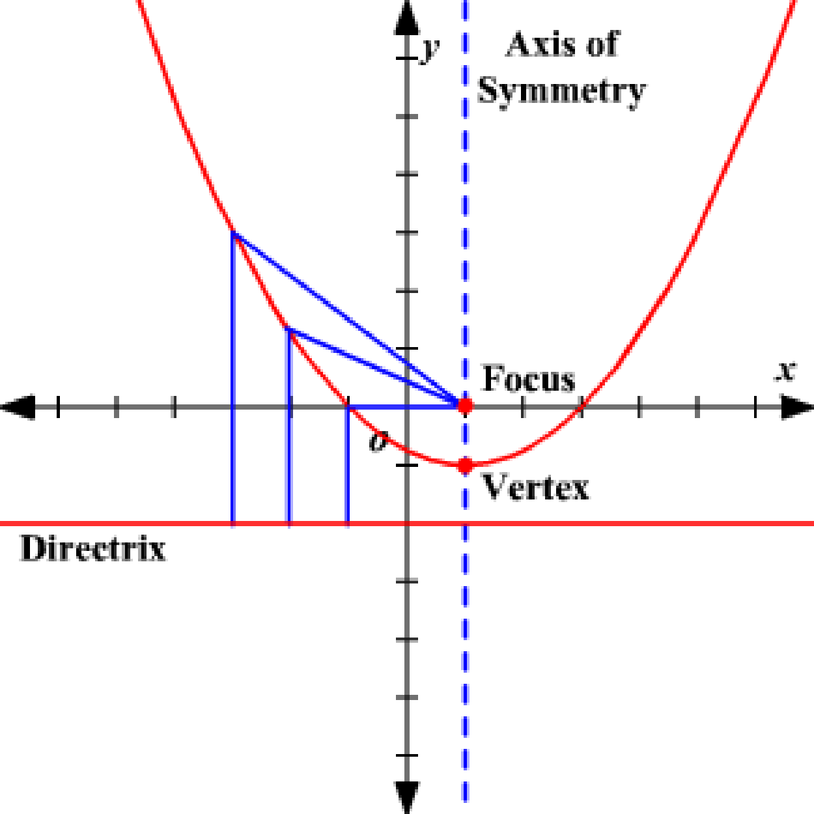

# The Parabola

The parabola is a familiar curve to any observant high school student. Its parent function $y=x^2$ is the first or second non-linear function most students encounter. It appears relentlessly in science and physics textbooks anytime one variable is related to the square of another. This happens in all 2D area formulas, Newton's law of gravity, Kepler's planetary orbits, Coulomb's law for electrical force and, thanks to calculus, the motion of any particle moving under constant force.

**Geometric Definition**: Given a point $F$ and a line $l$, a parabola is the locus of points $P$ such that the distance from $F$ to $P$ equals the distance from $F$ to $l$. The point $F$ is called the focus and the line $l$ is called the directrix.

{height=2in}

**Parent Equation**: $y = x^2$ is the parent equation for a vertical parabola. $x = y^2$ is the parent equation for a horizontal hyperbola (opens to the right). The vertex is at $(0,0)$ and represents an extremum (lowest point, or leftmost point)

**Standard Form**:

Notice this form is a bit surprising because the "squared term" is on the left hand side.

  * $(x-h)^2 = 4p(y-k)$ is a vertical parabola, opens up, centered at $(h,k)$. The center and the vertex are both at $(h,k)$ (it's usually just called the vertex, though.)
  * $(y-k)^2 = 4p(x-h)$ is a horizontal parabola, opens right, centered at $(h,k)$. The center and the vertex are both at $(h,k)$ (it's usually just called the vertex, though).

**Properties**

* The axis of symmetry is a line through the vertex which splits the parabola into 2 equal halves.
* The focus is $p$ units from the vertex of a parabola, inside the parabola, on the axis of symmetry.
* The directrix is $p$ units from the vertex of a parabola, outside the parabola, perpendicular to the axis of symmetry.
* Any ray of light, parallel to the axis of symmetry, that bounces off the inside of a parabola will be reflected to the focus. This is used extensively in designing lenses and mirrors.

## Exercises

### Fundamental Concepts

1. Find the standard form of the equation of the parabola *centered at the origin* with the given characteristics:
    1. Focus: $(0,1)$
    2. Focus: $(0,\frac12)$
    3. Focus: $(-2,0)$
    4. Directrix: $y=2$
    5. Vertical axis of symmetry; passes through $(4,6)$
    6. Horizontal axis of symmetry; passes through $(-2,5)$
2. Find the standard form of the equation of the parabola
    1. Vertex $(2,6)$, Focus $(2,4)$
    2. Focus $(2,2)$, directrix: $x=-2$
    3. Vertex $(3,-3)$; vertical axis; passes through (0,0)
3. Find the vertex, focus and directrix. Then sketch.
   1. $y^2 = -6x$
   2. $x^2 + 12y = 0$
   3. $(y+7)^2 = 4(x-\frac32)$
   4. $y^2 + 6y + 8x + 25 = 0$
   5. $x^2 - 4x - 4y = 0$

### Deeper Understanding

4. **Coulomb's Law** Coulomb's Law states that the electrostatic force between two charged particles is inversely proportional to the squared distance between their centers. If the distance between two particles doubles, what is the proportional change to the electrostatic force?
5. **321 Zero** Prove the quadratic formula by completing the square on $y = ax^2 + bx + c$
6. **Home home on the range** What are the domain and range of $(x-h)^2 = 4p(y-k)$? State your answer in terms of $p, k, h$. What about $(y-k)^2 = 4p(x-h)$?
7. **Proofs and derivations.** The slope of the tangent line to $y = ax^2$ at any point $(x_1,y_1)$ on the parabola is given by $m = 2ax_1$. Write the point-slope formula for the equation of the tangent line at point $(x_1,y_1)$.  
8.  **Proofs and derivations.** Prove the distance from any point $(x_1,y_1)$ on the parabola $y^2 = 4px$ to the focus is the same as the perpendicular distance to the directrix.
9.  **Proofs and derivations.** Prove the reflection property in a parabola: $x^2 = 4py$
    1.  Write the equation of the tangent line at point $(2ap, a^2p)$ on the parabola.  (This simplifies the algebra but it's still an arbitrary point).
    2.  Find the $y$-intercept of the tangent line
    3.  Consider a vertical ray of light that hits the parabola at $(2ap, a^2p)$ This light reflects to the focus. Draw and label a diagram.
    4.  Finish the proof using geometry. (Can you find congruent angles?)
10. **It's still not "discriminate"**. The *discriminant* $\Delta$ of a conic section was given in the hyperbola notes. What is the discriminant of a parabola? 

---
geometry: margin=1in
header-includes:
- |
  \let\oldsection\section
  \renewcommand{\section}[1]{\clearpage\oldsection{#1}}
	\def\tightlist{}
---
