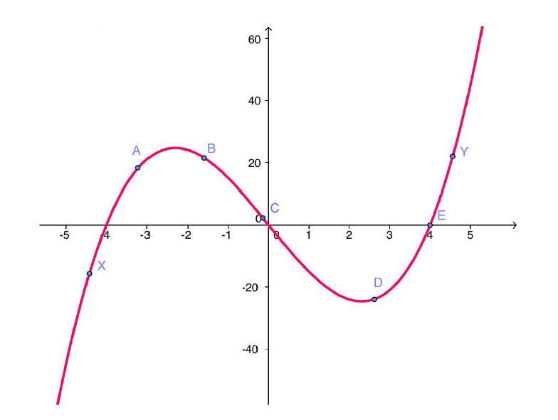

# Math 10 Derivatives Test

1. Let $f(x)=\sqrt{x}$. What is the equation of the tangent line to $f$ at the point $(4,2)$?

(A) $y=\frac{1}{4} x+1$

(B) $y=-\frac{1}{2} x+3$

(C) $y=\frac{1}{2} x$

(D) $y=2 x-6$

1. What is the derivative of $s(t)=\cos \left(t^2 + 1\right)$ ?

(A) $-2t\sin(t^2+1)$

(B) $-(t^2+1)\sin(t^2+1)$

(C) $\cos(2t)$

(D) $-\sin(2t)$

3. If $f$ and $h$ are nonzero differentiable functions, then the derivative of $\dfrac{f}{h}$ is

(A) $\dfrac{f^{\prime} h - f h^{\prime}}{h^2}$

(A) $\dfrac{f^{\prime} h + f h^{\prime}}{h^2}$

(C) $\dfrac{f h^{\prime} - f^{\prime} h}{h^{2}}$

(D) $\dfrac{f^{\prime}}{h^{\prime}}$

1. The line tangent to the curve $y=\sqrt{16-x}$ at the point $(0,4)$ has slope

(A) $\dfrac{-1}{8}$

(B) 4

(C) $\dfrac{1}{8}$

(D) $-4$

1. If $y=6 \ln (3 x)$ then what is $y^{\prime}$ ?

(A) $\dfrac{6}{x}$

(B) $\dfrac{2}{x}$

(C) $\dfrac{1}{3x}$

(D) $\dfrac{18}{x}$

1. What is the value of

$$
\lim _{\Delta x \rightarrow 0} \frac{2(x+\Delta x)^{2}-2 x^{2}}{\Delta x}
$$

(A) $4x$

(B) $2x$

(C) 4

(D) 2

1. If $w(t)=\sqrt{t^{2}-1}$ what is the value of $w^{\prime}(4)$ ?

(A) $\dfrac{4}{\sqrt{15}}$

(B) $\dfrac{2}{\sqrt{15}}$

(C) $\dfrac{1}{\sqrt{15}}$

(D) $\dfrac{1}{2 \sqrt{15}}$

9. At which $x$ value does the graph of $y=3 x^{2}-10 x+15$ have a horizontal tangent line?

(A) $\dfrac{5}{3}$

(B) $\dfrac{-3}{5}$

(C) $\dfrac{3}{5}$

(D) $\dfrac{-5}{3}$

1.  If $h(x)=f\left(x^{2}+1\right)$ then which of the following is true?

(A) $h^{\prime}(x)=2x f^{\prime}\left(x^{2}+1\right)$

(B) $h^{\prime}(x)=f^{\prime}(2 x)$

(C) $h^{\prime}(x)=2 x f^{\prime}(2 x)$

(D) $h^{\prime}(x)=f^{\prime}\left(x^{2}+1\right)$

1.  If $f(x)=\sin \left(2x +1\right)$ and $g(x) = f^{\prime}(x)$, find $g^{\prime}(x)$

(A) $g^{\prime}(x) = -4 \sin (2x + 1)$

(B) $g^{\prime}(x) = 2 \sin (2x + 1)$

(C) $g^{\prime}(x) = 4 \sin(2x + 1) \cos(2x + 1)$

(D) $g^{\prime}(x) = -4x \cos(2x + 1)$

1. The graph of a continuous differentiable function $f$ is shown below.\
{ width=60% }\
Using the above graph, select the one true statement below.

(A) $f'(C) < f'(D) < f'(Y)$
(B) $f'(A) < f'(B) < f'(C)$
(C) $f'(X) < f'(Y) < f'(C)$
(D) $f'(X) < f'(B) < f'(E)$

1.  Let $f(x)=x^{3}-6 x^{2}+10$. At which point(s) on the graph of $f$ is the tangent line parallel to the line $15 x-y=11$ ?

(A) $(5,-15)$ and $(-1,3)$

(B) $(2,-6)$ and $(-2,22)$

(C) $(2,-6)$ and $(-2,-22)$

(D) $(5,-15)$ and $(2,-6)$

1. If $y(x) = \dfrac{\sin(2x)}{x^2}$ find $y'(x)$

(A) $\dfrac{2 x \cos(2 x) - 2 \sin(2 x)}{x^3}$
(B) $\dfrac{ 2 \cos(2x)}{x}$
(C) $\dfrac{ x^2 \cos(2x) - \sin(2x)} { x^3}$
(D) $\dfrac{ x^2 \sin(2x) + 2 \cos(2x)} {x^4}$

2. Calculate $\dfrac{d}{dt} \left( \ln(e^{2t}) - 2t \right)$

(A) 0
(B) $\dfrac{1}{2t}-2$
(C) $\dfrac{2}{e^{2t}}-2$
(D) $\dfrac{1}{2e^{2t}}-2$
