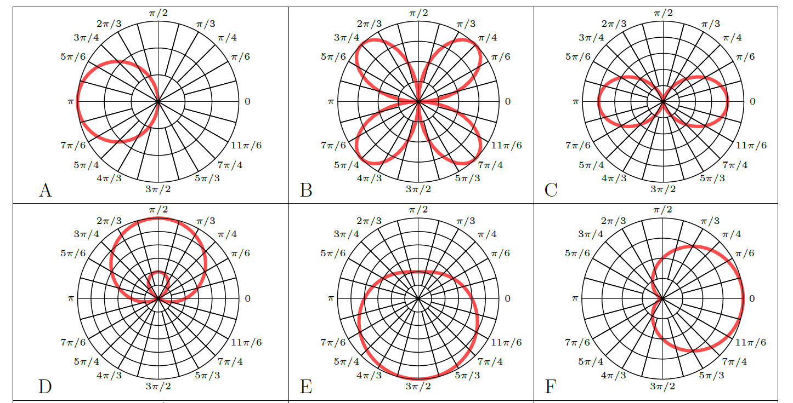

# Parametrics and Polar Test
DRAFT / QUESTION BANK

## Parametric Equations
1. Eliminate the parameter and find a rectangular equation
for the following parametric equations. Show all work.

	A)  [3pts] $x=t^3$ and $y=1-t$
	B)  [3pts] $y = 4\sin t$ and $y = 3\cos t$

1. Graph the curve whose parametric equations are given, indicating
the orientation of the curve with arrows.

	A)  [3pts] $x = t+5$ and $y=(t-1)^2$ where $-2 \leq t \leq 2$
	B)  [3pts] $x(t) = 4\cos t$ and $y(t) = 4\sin t$ where $0 \leq t < 2\pi$

## Polar Coordinates

   1. [2pts]  Convert $(5,-5)$ to polar coordinates with $0 \leq \theta < 2\pi$
   2. [2pts]  Convert $(2,6\sqrt3)$ to polar coordinates with $0 \leq \theta < 2\pi$

   3. [2pts]  Convert $(6,2\pi/3)$ to rectangular coordinates
   4. [2pts]  Convert $(5,3\pi/2)$ to rectangular coordinates
   5. [2pts] Which of the following is not a possible coordinate for the indicated point.

   	  A)  $(-2, -\pi/3)$
   	  A)  $(2,\pi/3)$
   	  B)  $(-2, 4\pi/3)$
   	  C)  $(2, 13\pi/3)$
   	  D)  $(-2, -8\pi/3)$
   6. [2pts]  Which of the following *polar coordinate* points is furthest from the origin?
   
	  A)  $(-3,\pi/2)$
   	  B)  $(2,3\pi)$
   	  C)  $(\pi,4)$
   	  D)  $(1,6\pi)$
   	  E)  $(4, 35)$
   	
   7. [2pts]  Convert to polar: $x^2-y^2 = 16$

      A)  $r^2 = \dfrac{16}{\cos^2 \theta - \sin^2 \theta}$
	  B)  $r = \dfrac{4}{\cos \theta - \sin \theta}$
	  C)  $r = \dfrac{16}{\sin \theta \cos \theta}$
	  D)  $r = \dfrac{16}{\sin \theta - \cos \theta}$
	  E)  $r = \dfrac{4}{\sin \theta - \cos \theta}$

   8.  [2pts]  Convert to rectangular: $r = \cos(\theta)$
	  
	   A)  $x^2 + y^2 = y$
	   B)  $x^2 + y^2 = x$
	   C)  $y = x^2 - y^2$
	   D)  $\sqrt{x+y} = y$
	   E)  $xy = 1 - y^2$
   9.  [2pts] Convert to rectangular $r = \sec(\theta)$

	   A)  $x=1$
	   B)  $y=1$
	   C)  $xy = 1$
	   D)  $y = x$
	   E)  $y = -x$

   
   10. [2pts]  Which of the above (A-F) is the graph of $r = 4\sin(2\theta)$?
   11. [2pts]  Which of the above (A-F) is the graph of $r = -3\cos(\theta)$?
   12. [2pts]  Which of the above (A-F) is the graph of $r = 2+2\cos(\theta)$?

## True/False

1. [1pt] It is possible for a single point in the plane to have the same coordinates in both rectangular and polar representations.
2. [1pt] A function $y=f(x)$ cannot intersect itself
3. [1pt] The graph of a parametric system cannot intersect itself.
4. [1pt] Graphs of polar functions never fail the vertical line test.
5. [1pt] Every point in the plane has infinitely many polar coordinate representations.

## Free Response

A baseball pitcher throws a baseball with an initial speed of 138
feet per second at an angle of 20° to the horizontal. At time $t=0$, the ball leaves
the pitcher's hand at a height of 4 feet above the ground.

1. [1pt] Find four parametric equations that describe the position and velocity of the ball as a function of time. (Assume the ground has a $y$-coordinate of 0).

1. [1pt] Set up but do not solve an equation to answer: How long is the ball in the air? 

2. [1pt] Set up but do not solve an equation to answer: At what time does the ball reach its maximum height?

3. [1pt] What is the height of the ball after 5 seconds?

4. [1pt] Does the ball fly for more than 8 seconds?