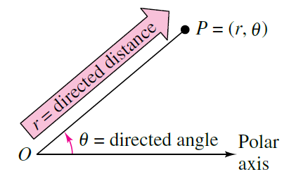
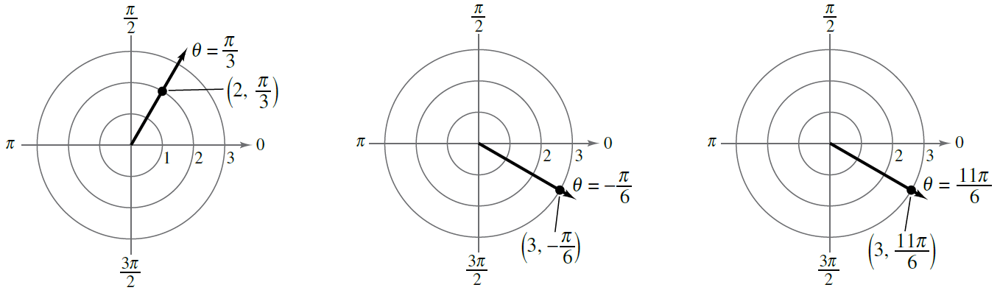
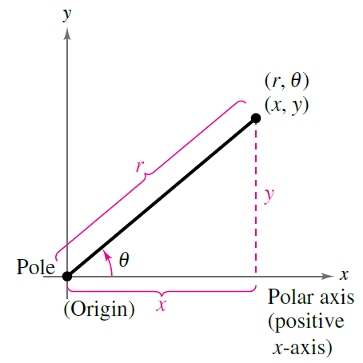

# Polar Coordinates and Graphs

You know the rectangular, or Cartesian, coordinate system very well. Given an origin, $O$, and a set of orthogonal axes $x$ and $y$, and a unit length, if you want to find the point, say $(5,2)$, you simply intersect the lines $x=5$ and $y=2$. The unique intersection point is the point $(5,2)$. 

The rectangular coordinate system is not the only way to find points on a plane, however. One other common way of defining a point's location is by finding its *distance* to the origin and it *angle* from some fixed direction.

We can define a coordinate system this way -- one axis, the $r$ axis, measures the distance from $O$, and the other axis, the $\theta$ axis, measures the angle from standard position (standard position starts at $\theta=0$ 
on the unit circle.) A coordinate such as $(3,\pi/2)$ would indicate a point
that is 3 units away from the origin and at an angle of $\pi/2$ radians
in standard poisition (so, 12 o'clock).

{width=33%}

### Examples

Plot the following points in polar coordinates:

1. $(2, \pi/3)$
2. $(3, -\pi/6)$
3. $(3, 11\pi/6)$

### Solution:

{width=100%}

Notice how the second and third points have the same position on the plane but different polar representations. This is a peculiar property of this coordinate system -- points are not unique. In fact any point can have infinitely many representations by replacing $\theta$ with any coterminal angle. Also any point $(r,\theta)$ is equivalent to the point $(-r, \theta + \pi)$ because a negative $r$ value corresponds to a distance in the opposite direction of $\theta$.

Also notice how it can be helpful to think of a point, such as $(2,\pi/3)$ as the intersection of the *circle* $r=3$ with the *ray* $\theta=\pi/3$. **Every polar coordinate is found at the intersection of a circle and a ray.**

### Practice

Plot the following points in polar coordinates:

1. $A=(3, \pi/4)$
2. $B=(2, -\pi/6)$
3. $C=(-3, \pi/6)$
4. $D=(0, \pi)$
5. $E=(3,0)$
6. $F=(-2,5\pi/6)$

{width=25%} {width=25%}

Write coordinates for the points on the above graph. To ensure uniqueness, only use $r \geq 0$ and $-\pi < \theta \leq \pi$

## Coordinate Conversion

Any time multiple coordinate systems are used to define the same region of space, it is important to have a way to convert from one representation to another. For example, the point $(6,6)$ in rectangular coordinates is equivalent to $(6\sqrt2, \pi/4)$ in polar coordinates. 

{ width=33% }

The figure above shows two representations for one point. By solving the
triangle we can convert between coordinate systems:

  
| $x = r \cos \theta$  | $y = r \sin \theta$  |
|---|---|
| $x^2 + y^2 = r^2$   |  $\tan \theta = \dfrac{y}{x}$ |

The first row converts $(r,\theta)$ to $(x,y)$ and the second row converts $(x,y)$ to $(r, \theta)$. Since $\tan \theta$ is a periodic function, determining $\theta$ from $(x,y)$ will require a bit of consideration of the correct quadrant.

## Examples

* Convert $(\sqrt3, \pi/6)$ to rectangular coordinates. *Solution*: $x = r \cos \theta = \sqrt3 \cos(\frac{\pi}{6}) = \sqrt3 \cdot \frac{\sqrt3}{2} = \frac32$ and  $y = r \sin \theta = \sqrt3 \sin(\frac{\pi}{6}) = \sqrt3 \cdot \frac{1}{2} = \frac{\sqrt3}{2}$. So the rectangular coordinate is $(\frac32, \frac{\sqrt3}{2})$. 
* Convert $(-1,1)$ to polar coordinates. *Solution*: $r = \sqrt{-1^2+1^1} = \sqrt2$ and $\tan \theta = \frac{1}{-1} = -1$. $\tan \theta = -1$ when $\theta = \frac{3\pi}{4}$ and when $\theta = \frac{7\pi}{4}$. Since the given point is in the second quadrant, we must select the angle $\theta = \frac{3\pi}{4}$. This gives the final coordinate $(\sqrt2, \frac{3\pi}{4})$.

### Practice

1. Convert $(3,\sqrt3)$ to polar
2. Convert $(-5,0)$ to polar
3. Convert $(-2,-2\sqrt3)$ to polar
4. Convert $(4,\dfrac{3\pi}{4})$ to rectangluar
5. Convert $(-3, -\dfrac{5\pi}{6})$ to rectangular
6. If $(a,b)$ is the same point in polar or rectangular coordinates, describe $a$ and $b$.

## Equation Conversion

The graph $y=x^2$ is familiar to you as a parabola. It is possible to represent the same set of points on this parabola with an equation in polar coordinates. To do so, we make similar substitutions as we did when converting coordinates. In particular since $y=r \sin \theta$ and $x = r \cos \theta$ we can write this parabola as

$r \sin \theta = (r \cos \theta)^2$

and solving for $r$, 

$r = \tan \theta \sec \theta$

We have just found the polar equation for a parabola. We will see how to graph this and other equations soon.

It is also possible, but often trickier, to convert a polar equation into a rectangular one. Here are some examples

* $r = 2$. Square both sides: $r^2 = 4$ and substitute $x^2 + y^2 = 4$. This is circle
* $\theta = \pi/3$. Take tangent of both sides: $\tan \theta = \tan \frac{\pi}{3} = \sqrt3$ and substitute: $\dfrac{y}{x} = \sqrt3$ so $y = \sqrt3 x$. This is a line through the origin.
* $r = 2 \sec \theta$. Divide by $\sec \theta$: $r \cos \theta = 2$ and substitute: $x = 2$. This is a vertical line.

### Practice

Convert the following equations

1. $x^2 + y^2 =  4$
2. $y = 1$
3. $xy = 4$
4. $r^2 = r \cos \theta$
5. $r = 4 \csc \theta$
6. $r^2 = \sin 2\theta$

---
geometry: margin=1in
header-includes:
- |
  \let\oldsection\section
  \renewcommand{\section}[1]{\clearpage\oldsection{#1}}
	\def\tightlist{}
---
