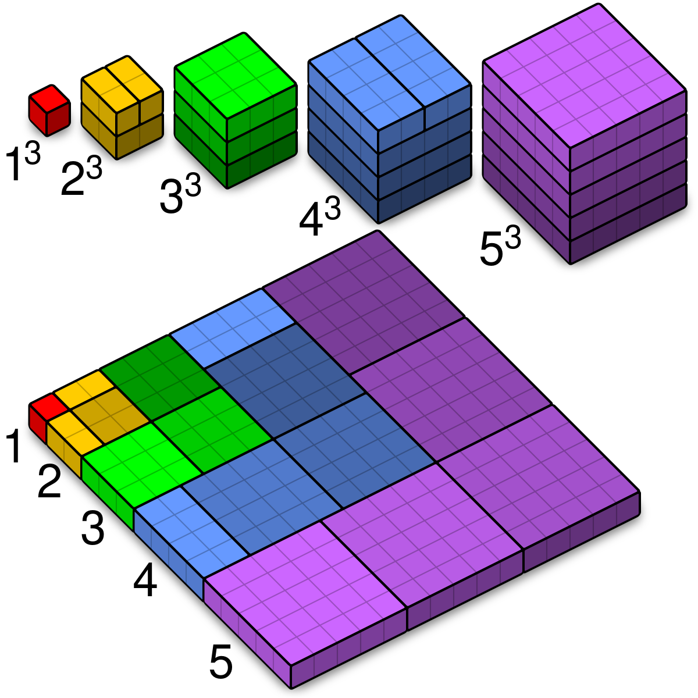
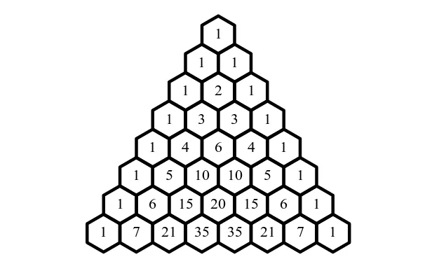

# Sequences and Series

## Useful formulae
*  $a_n = a_1 + d(n-1)$
*  $a_n = a_0 + nd$
*  $a_n = a_1 r^{n-1}$
*  $a_n = a_0 r^{n}$
*  $\displaystyle \sum_i a + d (i-1) = S_n =n\left(\dfrac{a_F + a_L}{2}\right)$
*  $\displaystyle \sum_{i} a r^{i-1} = S_n =\dfrac{a_F(1-r^n)}{1-r}$

*  $\displaystyle \sum_{i=1}^\infty a r^{i-1} = S_n =\dfrac{a_F}{1-r}$

In the preceding sums, $a_F$ is the first term and $a_L$ is the last term and $n$ is the number of terms. 

## Practice with arithmetic and geometric sequences
Write a formula for the $n$th term of each sequence below.

1.  $a_1=2, 5, 8, 11, \ldots$
2.  $a_1=-9, -11, -13, -15, -17, \ldots$
3.  $a_1=\frac52, \frac{17}{6}, \frac{19}{6}, \frac{7}{2}, \ldots$
4.  $a_1 = -3, 6, -12, 24, \ldots$
5.  $a_1 = 9, 6, 4, \frac83, \ldots$
6.  $a_1 = 0.1, 0.01, 0.001, \ldots$

For each of the sequences 1-6 find the term
$$a_{12}$$

For each the sequences 1-6 find the sum
$$\sum_{n=1}^{12} a_n$$

For each of the sequences 1-6 find the sum
$$\sum_{n=5}^{10} a_n$$

For the convergent geometric sequences determine
$$\sum_{n=1}^\infty a_n$$

For the convergent geometric sequences determine the first index $k$ for which
$$\sum_{n=1}^k a_n > \dfrac{999}{1000} \sum_{n=1}^\infty a_n$$

For sequence 1, solve the equation
$$\sum_{n=1}^k a_n = 345$$

For sequence 2, solve the equation
$$\sum_{n=k}^{2k} a_n = -1044$$

If a geometric sequence has $a_2 = 10$ and $a_{10} = 400$ find the common ratio and the term $a_{20}$

If an arithmetic sequence has $a_{10} = 50$ and $a_{25} = 170$, write a formula for $a_n$ and the sum of the first 12 terms, starting with $a_1$

## Take it to the limit

Evaluate the following infinite limits of sequences.

1. $\lim_{n \to \infty} \dfrac{n^2+2n-1}{3n^2 - 4}$
2. $\lim_{n \to \infty} \dfrac{n^3+2n-1}{3n^4 - 4}$
3. $\lim_{n \to \infty} \dfrac{\sqrt{n^2+2}}{2n+1}$
4. $\lim_{n \to \infty} \dfrac{n!}{2^n3^n}$
5. $\lim_{n \to \infty} \tan\left(\dfrac{\pi}{2} - \dfrac{1}{n}\right)$
6. $\lim_{n \to \infty} \tan\left(\dfrac{\pi}{2} + \dfrac{1}{n}\right)$
<<<<<<< HEAD
7. $\lim_{n \to \infty} \sqrt{\sin{\left(\dfrac{\pi}{4}+\dfrac{2}{n+1}\right)}}$
8. $\lim_{n \to \infty} \dfrac{f_{n+1}}{f_n}$ where $f_n$ is the $n$th Fibonacci number $(1,1,2,3,5,8,13,21,\ldots)$ (this is most likely a calculator or computer question)
=======
7. $\lim_{n \to \infty} \sqrt{\sin{\dfrac{\pi}{4}}+\dfrac{2}{n+1}}$
8. $\lim_{n \to \infty} \dfrac{f_{n+1}}{f_n}$ where $f_n$ is the $n$th Fibonacci number (this is most likely a calculator or computer question)
>>>>>>> 799924f (exams randomizer and sequences)

## Sums of powers

The sums $\sum_{k=1}^n k, \sum_{k=1}^n k^2, \sum_{k=1}^n k^3$ and in general $\sum_{k=1}^n k^p$  fascinated mathematicians  for centuries. We will derive some of these formulas in this section.

First, the following formulas you should be able to verify on your own

*  $\displaystyle \sum_{k=1}^n 1 = n$
*  $\displaystyle \sum_{k=1}^n k = \dfrac{n(n+1)}{2}$

The next is not obvious

*  $\displaystyle \sum_{k=1}^n k(k+1) = \dfrac{n(n+1)(n+2)}{3}$

But by inferring the pattern in the last 3 formula you should be able to complete

*  $\displaystyle \sum_{k=1}^n k(k+1)(k+2) =$

(These formulas involving "falling and rising factorials" are easily established using a branch of mathematics called *discrete calculus*)

Now your job is to find the equations for $\sum_{k=1}^n k^2$ and $\sum_{k=1}^n k^3$ by manipulating the above formulas.

Though messy, this procedure can be continued to find $\sum_{k=1}^n k^p$ for any $p$. These lead to the famous *Bernoulli Numbers*.

## Sums of Cubes

We share a "proof without words" relating the formulas for $\sum_{k=1}^n k$ and  $\sum_{k=1}^n k^3$, a.k.a Nichomachus' Theorem. Can you see the connection to the formula? Or can you figure out the formula from the picture?

{ width=50% }

## Shape Numbers

The sequence of the sum of the first $k$ integers is $1,3,6,10,15,\ldots$ are called the *triangular numbers.* This is because they can be shown to count the number of dots in increasingly large equilateral triangles. The sequence of sums of the triangular numbers is called the *tetrahedral numbers*. Can you find a formula for them?

There are also the more familiar *square numbers* and. What interesting formulas can you find with them?

And, of course, other shapes. Interesting ones to consider are the *hexagonal numbers* (and do they relate to the triangular numbers?) and the *pentagonal numbers* which have a nice closed form formula.

## Pascal's Triangle

The familiar Pascal's triangle is probably most associated with binomial expansions $(x+y)^n$ but it encodes a host of other interesting patterns. Look in the triangle below for the triangular and tetrahedral numbers? Can you explain why they are here? Can you find a formula that describes them?

<<<<<<< HEAD

{ width=50% }
=======
.gif>){ width=50% }
>>>>>>> 799924f (exams randomizer and sequences)

It is well known that the sums of the rows of Pascal's Triangle yield powers of two (check it out: $1+4+6+4+1 = 2^4$). Somewhat less well known is that a similar type of sum of Pascal's Triangle yields the Fibonacci numbers: $1,1,2,3,5,8,13, \ldots$. Can you find it?

---
geometry: margin=1in
header-includes:
- |
  \let\oldsection\section
  \renewcommand{\section}[1]{\clearpage\oldsection{#1}}
	\def\tightlist{}
---
