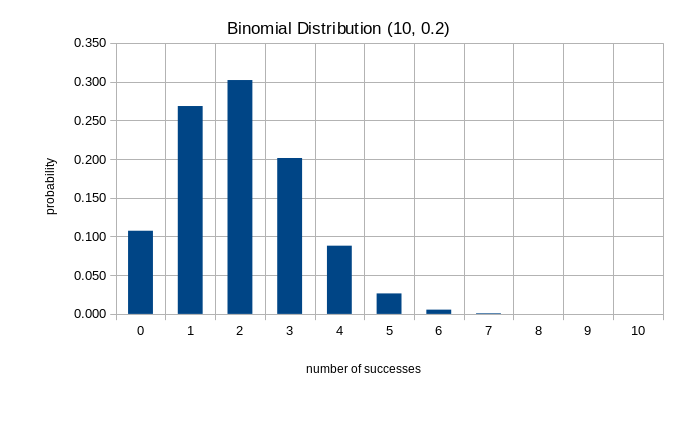

# Stats Day 3: Expectation and Variance

This is a really brief crash course in probability highlighs. But it's good for you to
know at least a bit about where "mean" and "variance" and "standard deviation" actually
come from in order to really understand the statistics we're going to be doing. We'll do
a couple easy examples.

### Expectation of The Uniform Distribution

In a uniform distribution, every outcome is equally likely. For example if you pick an integer between 1 and 4 from a hat,
every outcome has a probability of $\frac14$. We write this as a function $p(x) = \frac14$. The *expected value* of any
probability function $p(x)$ is defined as

 $E(X) = \displaystyle
\sum_x x\cdot p(x)$.

In this case, $E(X) = 1\cdot \dfrac14 +2\cdot \dfrac14 +3\cdot \dfrac14 +4\cdot \dfrac14 = \dfrac{10}{4} = 2.5$

This means that picking an integer between 1 and 4 from a hat has an expected value at 2.5. Which may seem odd because you can never actually pick the integer "2.5". It's not "expected" at all! But it is a *measure of central tendency* and that's what makes it important. It's an attempt to find the "middle" of the outcomes. We'll see in some cases the expected value (aka 'mean' or 'average') is a good measure of central tendency and in some cases it's quite bad.

### Expectation of The Binomial distribution

What is the expected value of the binomial distribution when
the number of observations is 10 and the probability of success is 0.2? Remember the probability function is $p(k; n,p) = \displaystyle {n \choose k} p^k(1-p)^{n-k}$. Hence the expected value is $E(X) = \displaystyle \sum_{k=0}^{10} k {10 \choose k} 0.2^k(0.8)^{10-k}$. Let's make a handy dandy table for this:

|$k$ | $p(k)$  | $k \cdot p(k)$ |
|----|-------|--------|
| 0  | 0.107 | 0.000  |
| 1  | 0.268 | 0.268  |
| 2  | 0.302 | 0.604  |
| 3  | 0.201 | 0.604  |
| 4  | 0.088 | 0.352  |
| 5  | 0.026 | 0.132  |
| 6  | 0.006 | 0.033  |
| 7  | 0.001 | 0.006  |
| 8  | 0.000 | 0.001  |
| 9  | 0.000 | 0.000  |
| 10 | 0.000 | 0.000  |
|    | **sum**   | **2**      |

Adding up the sum, it appears the expected value of the
distribution is 2. Which, in this case, makes perfect sense. If you "expect" 20% of the experiments to succeed, and you perform 10 of them, then you "expect" 2 to succeed. This is an example where "expected" kind of means what you, um, expect it to mean. Furthermore, if we consult a graph of this distribution we see that "2" is a good measure of the center of the distribution.

 **Theorem** The mean of a Binomial distribution with parameters $n$ and $p$ is $\mu = np$.

## Variance of the Uniform Distribution

The expected value (we'll usually say "mean" from now on) of a
distribution is a measure of center. The **variance**, which we look at now, is a *measure of dispersion*. It tries to quantify, in one number, how spread out the distribution is -- how far values tend to be away from the mean.

The formula for variance of a distribution is

$Var(X) = \displaystyle \sum_{x} (x-\mu)^2 p(x)$

Using our previous example with the sample space $\{1,2,3,4\}$ we caculate the variance to be

$Var(X) = \displaystyle \sum_{x=1}^4 (x-2.5)^2 \left(\frac14\right)$

This is $Var(X) = \dfrac{(1-2.5)^2 + (2-2.5)^2 + (3-2.5)^2 + (4-2.5)^2}{4} = 1.25$

## Variation of the Binomial distribution

From the variance formula and the above example

$Var(X) = \displaystyle \sum_{k=0}^{10} (k-2)^2 {10 \choose k} 0.2^k(0.8)^{10-k}$

and using our handy dandy table again

| $k$   | $p(k)$  | $(k-2)^2 \cdot p(k)$ |
|----|-------|----------------|
| 0  | 0.107 | 0.429          |
| 1  | 0.268 | 0.268          |
| 2  | 0.302 | 0.000          |
| 3  | 0.201 | 0.201          |
| 4  | 0.088 | 0.352          |
| 5  | 0.026 | 0.238          |
| 6  | 0.006 | 0.088          |
| 7  | 0.001 | 0.020          |
| 8  | 0.000 | 0.003          |
| 9  | 0.000 | 0.000          |
| 10 | 0.000 | 0.000          |
|    | sum   | 1.6            |

the variance is 1.6.

**Theorem** the variance of a Binomial distribution with parameters $n,p$ is $\sigma^2 = np(1-p)$

The variance is an example of a **second moment** which you may have seen, or will see, in physics class in the context of "moments of inertia", or later in Calculus class.

## Median and Standard Deviation

The mean is one measure of center. Another such measure is the **median** which is a number, $t$ with the property that $Pr[x > t] = Pr[x < t] = \frac12$. In other words, $t$ is in the middle of the distribution in the sense that half the probability is on either side.

The **standard deviation** is simply the square root of the variance and is more commonly used in applied statistical analyses than the variance. The reason to prefer the standard deviation is that the units are correct. If a data set is in grams, for example, the variance, since it is a squared sum, has units of grams-squared. The standard deviation has unit of grams, and so it can be added and subtracted from the mean or data points as needed.
