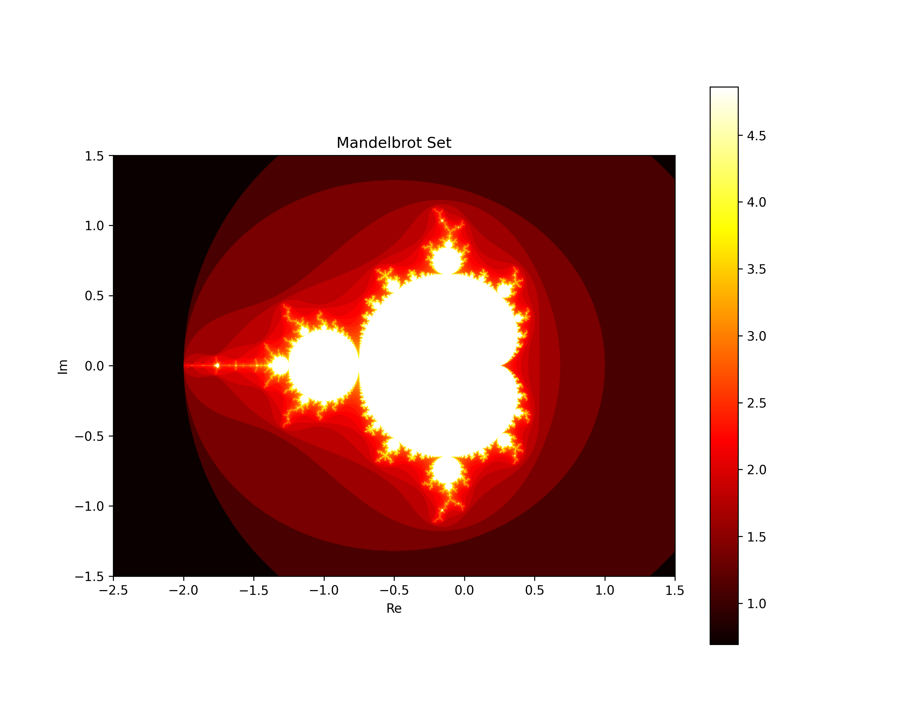

# Complex Day 4

## Quick Overview of Concepts, with Notation

* $z = a+bi$ can be graphed in the complex plane as the point $(a,b)$
* $\text{Re}(z)$ is the real part of $z = a+bi$ or $a$
* $\text{Im}(z)$ is the imaginary part of $z = a+bi$ or $b$
* $\arg(z)$ is the angle $\theta$ from standard position, $\tan \theta = y/x = b/a$
* $|z|$ is the modulus of $z$, or length of the vector from the origin to $z$, which is $\sqrt{a^2+b^2}$
* $z = re^{i\theta}$ is the polar form of $z=a+bi$ where 
  * $\tan \theta = b/a$
  * $a = r \cos \theta$
  * $b = r \sin \theta$
  * $r = \sqrt{a^2+b^2}$
* The conjugate $\overline{z}$ of $z$ is $\overline{z} = a - bi$
* Every polynomial of degree $n$ has $n$ roots in the complex plane, counting multiplicity
* Every root $f(z) = 0$ of polynomial $f$ corresponds to a linear factor $(x-z)$ of $f$.
* If $f(z) = 0$ then $f(\overline{z}) = 0$ if $f$ is a polynomial with real-valued coefficients.

## Applications of Polar

Euler's Identity
$$e^{\pi i} = -1$$ is of one the most famous equations in all of math. It allows us to conceive of complex multiplication and exponentiation as rotations, and these rotations make, in important ways, complex analysis much nicer than real analysis. Let's see what we can do with this

First $re^{i\theta}$ can always be written as $r(\cos \theta + i \sin \theta)$. In fact many precalculus books call *this* the polar form of complex numbers -- a travesty because it entirely removes the power and grace we get from working with the exponential form. But there is some benefit to using both expressions.

Raising this to a power $\left(re^{i\theta}\right)^n$ becomes $r^n(\cos n\theta + i \sin n \theta)$. When $n$ is a positive integer, this is known as *De Moivre's Theorem*. We can extend it to fractions: $\left(re^{i\theta}\right)^{1/n}$ becomes $r^{1/n}\left(\cos \dfrac{\theta}{n} + i \sin  \dfrac{\theta}{n}\right)$.

Using the fact that $cos(-\theta) = \cos\theta$ and $\sin(-\theta) = -\sin(\theta)$, we can consider 
$$e^{i\theta} + e^{-i\theta} =
        \left(\cos\theta + i \sin \theta\right) +
        \left(\cos\theta - i \sin \theta\right) $$
so that $$\cos\theta = \dfrac{e^{i\theta} - e^{-i \theta}}{2}$$
and similarly $$\sin\theta = \dfrac{e^{i\theta} + e^{-i \theta}}{2i}$$
(The details are left as an exercise for the reader.)

**Problems** Find $\sin(\pi i)$ and $\cos -i$

**Trig Identity Example:** Consider $\cos^2\theta = \frac14(e^{i\theta} - e^{-i\theta})^2 = \frac14(e^{2i\theta} + e^{-2i\theta}+2)
= \frac14(\cos2\theta + i\sin(2\theta)) + (\cos(-2\theta)+i\sin(-2\theta)+2)=\frac14(2\cos2\theta+2) = \dfrac{1 + \cos2\theta}{2}$

which proves $\cos(2\theta) = 2\cos^2(\theta) - 1$.

**Problem** Find $\cos3\theta$ and $\cos5\theta$. You may want to use Pascal's Triangle.

## Application: Pythagorean Triples

An ordered list of positive integers $(a,b,c)$ is a *Pythagorean Triple* if $a^2 + b^2 = c^2$. If $z=a+bi$ and its modulus $|z|$ form a Pythagorean triple, then so will $z^2$ and $|z^2|$ (we may have to take absolute values). Let's see an example

Example: If $z=|4+3i|$ and $|z| = 5$. You can compute $z^2 = 7+24i$ and find $|z^2| = 25$ and then check $7^2+24^2 = 25^2$ is a Pythagorean triple.

Problem: Prove why this is true. 
Extension: Prove it is true for any positive integer power, not just 2.

## Application: Prime Numbers and Factoring

A positive integer is *prime* if its only factor besides itself is 1. The *Fundamental Theorem of Arithmetic* say that all integers can be factored uniquely into a product of primes. For example $12 = 3 \times 2 \times 2$ and no other set of prime numbers will ever multiply to equal 12.

When we add in complex numbers, things get more interesting somewhat. A number $a+bi$ with $a$ and $b$ integers is called a *Gaussian Integer* and the set of Gaussian Integers is notated $Z[i]$. You may have noticed Gaussian integers can multiply to produce a real integer: $(3+4i)(3-4i) = 25$ for example. You may be surprised to know that Gaussian Integers can be multiplied to equal a *prime* number.

Problem: Which of these primes can you write as a product of Gaussian integers: 2,3,5,7,11,17,37? Can you find a pattern or rule of any type here?

## Application: Logarithms

In your youth you may have learned that you cannot take the logarithm of a negative number. From now on, if anybody says that, the proper response is "Well, maybe *you* can't take the logarithm of a negative number, but *I* sure can." Why?

Simple! $\ln(-4) = \ln(4 * -1) = \ln(4) + \ln(-1)$ by properties of logs. So we just need to know $\ln(-1)$. We need to solve $e^x = -1$

We learned above that $e^{\pi i} = -1$. So $x = \pi i$ is the natural log of $-1$. Huzzah.

Problems: Find all these: $\ln(-4)$, $\ln(-e^2)$, $\ln(100)$, $\ln(4i)$ (for the last one here's a hint: use the form $r(\cos \theta + i \sin \theta)$ and write an equation to solve.)

## Application: The Mandelbrot Set

No piece of mathematical knowledge from the last 100 years has captured the imagination or made such an impact on pop culture as the Mandelbrot Set. Although its heyday was closer to the turn of the century, its image can still be seen in computer-generated graphics and videos all over the world.

Check out this deep zoom video https://www.youtube.com/watch?v=pCpLWbHVNhk to get a taste of the literally inifinite complexity of this mathemtical landscape.

### The formula for the Mandelbrot set 
The Mandelbrot set is a classic example of an iterated function system (IFS). An IFS takes a function and a starting value and applies that function to the value, and then to the output of that, and then the output of that. The sequence it generates is

$$x,f(x),f(f(x)),f(f(f(x))), \ldots$$

This sequence may diverge, as it would with $f(x) = x^2$ and starting point $x=2$. It may converge as with $f(x) = \sqrt{x}$ starting at $x = 100$. Another less obvious convergent is $f(x) = \cos x$ starting at $x=1$. (You can do this on a Ti-whatever by keying in `1 enter` and then `cos(ANS) enter`. Keep pressing `enter` to iterate. You'll see this sequence converges to ____________ (you must be in radians).

Some sequences oscillate, like $f(x) = 3.2x(1-x)$, starting at $x=\frac12$. And often the behavior depends on the starting number ($f(x) = x^2$ diverges if $|x|>1$ and converges to 0 otherwise.)

The Mandelbrot set is a very simple IFS in the complex plane

$$z \leftarrow z^2 + c$$

Starting with $z=0$ and $c=$ any complex number. If the sequence of numbers $c, c^2+c, (c^2+c)^2+c, ((c^2+c)^2+c)^2+c, \ldots$ does **not** diverge to infinity, then the complex number $c$ is in the Mandelbrot set, shown below in black in the plane.

The fascinating part comes when we start considering the boundary between the black and white parts of this image. You see some circles and a cardioid. But if you zoom in? Before we zoom in, let's add color. If a point diverges, we'll color it based on how quickly it gets to a certain modulus

In this image, the darkest points get large very very quickly, the white points inside the mandelbrot set never reach a large modulus. In between there is a gradient. Zooming in the borders of these gradients, and adding more color for more precision is where the unbelievable complexity comes in. You may want to download an app on your phone (I like Fast Fractal) to experiment with this. Or try a website like https://math.hws.edu/eck/js/mandelbrot/MB.html. (Your phone will probably be much much faster with its upgraded GPU and optimized app code.)

There is a tremendous amount of structure and chaos in this map. As you explore it you will find mini copies of the big mandelbrot set and cardioid. This is because the set is *self-similar* -- it contains copies of itself. You will always find black regions (convergent) next to colored regions (divergent) and the boundary between the two is often infinitely complex. Moving one millionth of a percent could change the point from convergent slowly to divergent rapidly. This is a hallmark of *chaos*, which is a well-defined mathematical concept meaning a dynamical system is sensitive to initial conditions. Pick a point on the border and you will never be able to give enough decimal places to specify for sure if the sequence diverges or converges.

All this from one simple, quadratic equation in the complex plane!

Here's a fun applet for exploring this behavior. You can plot the several first iterates (points in the seuqnce) and really get a sense of what's happening! https://www.geogebra.org/m/mfewjrek