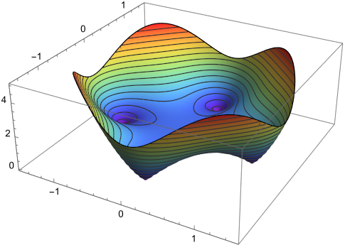

# The Unsolvable Polynomial 

In yesterday's notes we pointed out $i$ (and $-i$) are the solutions to $x^2=-1$. Are they the only solutions? To answer this we recall the following theorem:

**Factor Theorem**: If $f(x)$ is a polynomial in $x$ and $f(c) = 0$ for some complex number $c$, then $(x-c)$ is a factor of $f(x)$.

**Example**: The polynomial $f(x) = x^2+5x+6$ has a zero at $f(-2) = 0$ and $f(x) = (x+2)(x+3)$ so $(x+2)$ is a factor of $f$.

**Claim** Every quadratic polynomial $f(x)$ has at most two zeros.

Justify the claim above using the factor theorem

**Corollary** $x^2=-1$ has only two roots: $i$ and $-i$.

Justify the corollary using the claim.

On the other hand, we know the quadratic formula will always provide two roots (possibly complex) to a quadratic polynomial. So there are at least two roots. And from the claim there are at most 2. So there must be exactly two! 

(The careful reader will protest at this point "what about a double root!?" Good point, careful reader. We count double roots *twice* since they provide two factors with same root: $x^2+2x+1 = (x+1)(x+1)$. This is called a root of multiplicity 2.)

Hence: *Every quadratic polynomial has exactly two roots, counting multiplicities*.

A natural question to ask at this point is: can I write a polynomial that doesn't have a zero unless I invent a new type of number "beyond complex." Let's explore this by trying equations like $x^k = -1$ First some things to factor

* $x^2 - a^2 =$
* $x^2 + a^2 =$ (use imaginary numbers!)
* $x^3 - a^3 =$ (recall from algebra)
* $x^3 - a^3 =$ (completely factor the quadratic term)

* $x^3 + a^3 =$ (recall from algebra)
* $x^3 + a^3 =$ (completely factor the quadratic term)

* $x^4 - a^4 =$ (use some things above and *completely* factor)
* $x^4 + a^4 =$ (use some things above and *completely* factor)

If you're factoring correctly, every binomial above should factor and the number of linear factors should equal the degree of the original binomial.

Using your results above it's possible to solve $x^2 = -1$ and $x^3 = -1$ and $x^4 = -1$ and *even* to find 2,3, or 4 solutions depending on the degree. In fact they even give solutions to things like $x^4 = -i$ or $x^3 = -2+\sqrt2 i$. Messy solutions but solutions nonetheless. Our search for an unsolvable polynomial is off to a bad start. 

## Visualizing 

### $y = x^4 + c$
Get out your laptop and graph $y=x^4+1$ and $y=x^4-1$ on Desmos (or your favorite graphing tool.) Pretty boring. To spice it up make a slider for $y=x^4 + c$ and describe what happens to the roots as $c$ ranges from -5 to 5.

If $x$ is allowed to be *complex* though, the graph becomes vastly more interesting. What the graph of $y = x^4 + i$? Let's upgrade Desmos to https://samuelj.li/complex-function-plotter/. 

### $w=z^4-1$

The universal (sortof) letter for a complex variable is $z$, and its buddy is $w$. In the function plotter you just pulled up, enter ''z^4+1''

Whoa. Ok what's going on here? First of all this is the complex plane. Every point $a+bi$ is being plugged into $y=z^4+1$. The result is a complex number. That complex number, as a point in polar form, has a magnitude and an argument (angle). The lines you see (circles, blobs, teardrops) are *contours* where the magnitude is constant. 

The 3D plot shows the contours as height. In this plot the magnitude of the value of $z^4-1$ is the $z$-axis. You can see the zeros as sharp points. Compare this graph to its contour plot on the left (the colors mean different things in each graph, so don't worry about that part).

The colors are based on the angle. The part we care about are the four nested circles.

**At the center of the nested circles are the 4 zeros of $z^4 + 1 = 0$**. You can see, they are all complex roots -- none of them is on the $x-axis$ (the real axis)

* Zoom in on the first quadrant root and write their its value accurate to 3 decimal places. Can you tell *where* this point is on the unit circle (what is $\theta$? and what is $r$?)
* Write all four roots of $z^4 = -1$ in the form $r = ?$ and $\theta = ?$ where you fill in the question marks

### $w=z^4+1$

Now change your plot to ''z^4+1'' and do the same analysis. What are the $r$ and $\theta$ values for the roots? 

What are the roots in $a+bi$ form?

### Slider fun $w = z^4 + c$

This calculator has sliders too! Pull down the menu (top right), delete any variables there (trash can) and *add a new variable c*. Make it range from $-5 to 5$ (click on the numbers to edit). Now *edit the equation* $z^4 + c$. Press play. Compare this to the same animation in Desoms. *Explain* what you are seeing, specifically related to the roots.

Summarize your findings by describing $r$ and $\theta$ for the zeros of $z^4 + c$. (What determines $r$? What determines $\theta$? How are they related to $c$?)

### Cubics $w = z^3 + c$

Do a similar analysis for the roots of the cubic $z^3 + c$. Try some different $c$ values. Use a slider. Explain what you're seeing in your answers the questions below

* How many roots are there? How many real and how many complex?
* What are the $r$ and $\theta$ values for the roots? What determines each?
  
### The quest continues

Now it's your turn to get creative. Try any polynomial you want like, say, $z^4 - 5*z^3 + 2 *z^2 - 8*z + 1$. (you have to type the asterisk for times.) Change the degrees. Change the constant value. Use complex coefficients! (Like $(1+i)*z^3 - (2+i)$). Include ridiculous numbers like $4^i$ or $\sqrt{\sqrt{\sqrt{i}}}$ And look for patterns. Record your findings. Some things to consider

* How many zeros are there? How may real and how many complex?
* Are there any patterns in the zeros?
* Can you create a polynomial with a double root somewhere?
* Can a complex number be a double root? Give an example if so.
* What can you say about the argument and magnitude of the roots?
* And, ultimately, can you find a polynomial with fewer roots than its degree? Or more?

## Summing Up

Hopefully this exploration has shown you a few things about polynomials. Answer the questions below 

* How many solutions are there to $x^n = 1$?
* Describe where these solutions are in the complex plane.
* How many roots does an *n*th degree polynomial with complex coefficients have?
* Can a polynomial have 3, and only 3, complex roots and no real roots?

## Bonus

Graph the polynomial 'z^4+exp(i*t)' for a new slider $0 \leq t \leq 2\pi$. Watch the animation. Can you explain what's going on? We will learn about this next week.