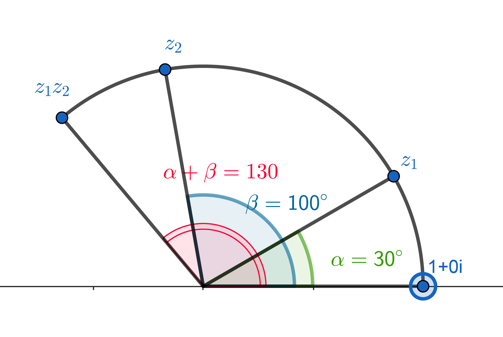
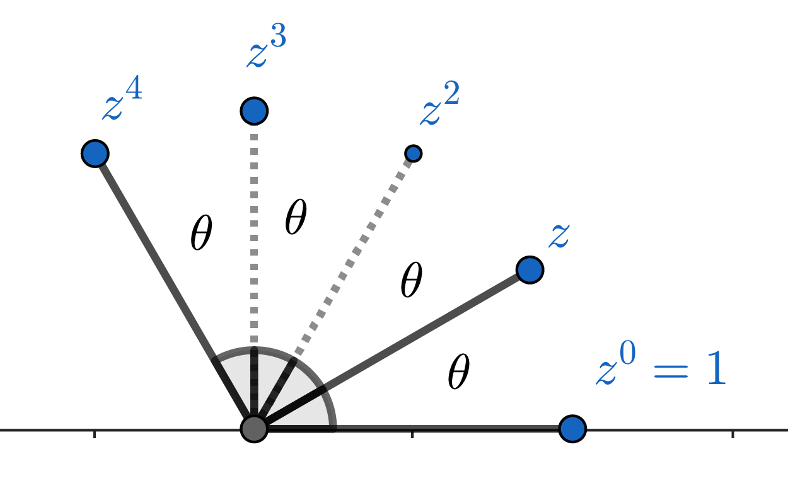

# Complex Day 3: Polar Form

The complex number $1+1i$ can be represented by the vector $\langle 1,1 \rangle$ in the complex plane. Vectors, as you know, have a length and an angle. The length of this vector is $\sqrt2$ and its angle is $\dfrac{\pi}{4}$. The complex number $1+1i$ can be written in *polar form* as $\sqrt2 e^{(\pi/4)i}$. (What does $e$ have to do with anything? That's a deep question so for now let's just treat it as what computer programmers call "syntactic sugar." It's just a way of encoding the data).

**Polar form** The polar form of a complex number $a+bi$ can be written as $re^{i\theta}$ where 
* $r^2 = a^2 + b^2$
* $\tan \theta = \dfrac{b}{a}$
If those formulas look familiar, *congratulations*. It means you've been paying attention the last 6 weeks! Converting a rectangular form complex number to a polar form complex number is just like converting rectangular to polar coordinates! So if you're given $r e^{i \theta}$ and want to find $a+bi$.
* $a = r \cos \theta$
* $b = r \sin \theta$

The length $r$ is often called the **modulus** and the angle $\theta$ is the **argument**. 

### Practice

Convert the following

1. $4-4i$
2. $-10\sqrt3 - 30i$
3. $1$ (write as $a+bi$ first)
4. $-1$
5. $i$
6. $-i$
7. $4e^{-2\pi i/3}$
8. $3e^{\pi i}$
9. $6e^{5 \pi i}$
10. $e^{5\pi i/4}$
11. (calc) $8.2-6.5i$
12. (calc) $5.41e^{2.7i}$

## Multiplication

While working on your day 2 graphs, you were asked several questions about the $r$ and $\theta$ values for complex numbers. Less often were you asked for $a+bi$. There's a good reason for this. Polynomials involve multiplication and raising numbers to a power -- these operations are much easier, and much more well described -- by thinking in polar terms. Let's see why.

To multiply $(a+bi)(c+di)$ requires a bit of distributing and simplifying. Evaluating $(a+bi)^5 = (a+bi)(a+bi)(a+bi)(a+bi)(a+bi)$ is quite a bit worse. In polar though, it's quite easy

$$r_1e^{i\theta_1}r_2e^{i\theta_2} = r_1r_2e^{i(\theta_1+\theta_2)}$$

To multiply polar form complex numbers you multiply the moduli and add the arguments! It's simply basic exponent rules from algebra.
Even better

$$(re^{i\theta})^p = r^pe^{i\cdot p \theta}$$

Once again basic exponentiation rules. In fact $p$ can be a fraction so

$$\sqrt{re^{i\theta}} = \sqrt{r} e^{i\theta/2}$$

And, as you would expect, it works for division, too. 

$$\dfrac{r_1e^{i\theta_1}}{r_2e^{i\theta_2}} = \dfrac{r_1}{r_2}e^{i(\theta_1-\theta_2)}$$

### Examples

1. $3e^{\pi i/2} \cdot 3e^{2\pi i/3} = 9e^{7\pi i/6}$
2. $\dfrac{8e^{-\pi i/3}}{4e^{5\pi i/12}} = 2e^{-\pi i/4}$
3. $\left(2e^{1.4\pi} \right)^4 = 16e^{5.6i\pi}$
4. $\sqrt[3]{27e^{\pi}} = 3e^{\pi/3}$

## Rotations

If $z_1=e^{i \alpha}$ and $z_2= e^{i\beta}$ then $z_1z_2 = e^{i(\alpha+\beta)}$ can be interpreted as a *rotation*. See the image below. The argument of the product is the sum of the two arguments of the factors, which can be seen as *rotating* the first vector towards the second vector.

If multiplication is rotation, then exponentiation is repeated rotation. For example

$$\left(e^{i\theta}\right)^4 = e^{4i \theta}$$

## Practice

Find the product and sketch $z_1$, $z_2$ and $z_1z_2$.

1. $z_1 = e^{\pi i/6}$, $z_2 = e^{2\pi i/3}$
2. $z_1 = e^{-\pi i/3}$, $z_2 = e^{\pi i/2}$
3. $z_1 = e^{7\pi i/12}$, $z_2 = e^{3\pi i 4}$
4. $z_1 = e^{2.3 i}$, $z_2 = e^{-1.6 i}$

Evaluate and sketch the power given

1. $z = e^{\pi i/4}$. Find $z^3$
2. $z = e^{\pi i}$. Find $z^8$.
3. $z = e^{-5\pi/6}$. Find $z^3$.

## Justifiying all this

It's clearly convenient to work with complex numbers in this notation. But *why* is multiplication the same as rotation? Is this even valid? It is! Let's see why

Let $z_1 = e^{i \theta_1}$ and $z_2 = e^{i \theta_2}$ be any complex numbers on the unit circle ($r=1$). We'll prove $z_1z_2=e^{i(\theta_1+\theta_2)}$.

Write $z_1$ and $z_2$ in rectangular form.

Multiply $z_1$ and $z_2$.

Use the addition law for cosine and sine to simplify.

## Application: Cube Roots of 1

Solving the equation $x^3 = 1$ in the complex plane is a great problem to illustrate these ideas, and relates to your graphing activity from last class. You should know by now that $x^3=1$ will have three complex zeros. So $-1$ has three cube roots.

#### Step 1: Express the Equation in Polar Form

First realize that $1 = e^{0i}$, but also, because of coterminal angles, $1 = e^{2\pi k i}$ for any integer $k$. We will need this to find *all three* cube roots of $-1$. We are essentially looking for all complex numbers $x = re^{i\theta}$ such that 

$$(re^{i\theta})^3 = e^{2k \pi i}$$

#### Step 2: Solve for $x$ in Polar Form

Given $x^3 = 1$, or equivalently, $r^3e^{i3\theta} = 1e^{2k \pi i}$. Since the magnitudes on both sides must be equal, and the magnitude of the right-hand side is 1, we have $r^3 = 1$, leading to $r = 1$.

For the angles, $3\theta = 2\pi k$, giving us $\theta = \frac{2\pi k}{3}$. Since angles in the complex plane are typically considered within the range of $0$ to $2\pi$, we take $k = 0, 1, 2$ to find all unique solutions within this range.

Thus, the three solutions in polar form are:
- $k = 0$: $e^{i0} = 1$ (the real solution)
- $k = 1$: $e^{i\frac{2\pi}{3}}$
- $k = 2$: $e^{i\frac{4\pi}{3}}$

### Step 3: Convert to Rectangular Form

Use the formulas given on the first page for conversion.

1. **For $k = 0$**: The solution is simply $1 + 0i$, or just $1$.

2. **For $k = 1$**: $e^{i\frac{2\pi}{3}} = \cos\left(\frac{2\pi}{3}\right) + i\sin\left(\frac{2\pi}{3}\right)$. Evaluating the cosine and sine gives us $-\frac{1}{2} + i\frac{\sqrt{3}}{2}$.

3. **For $k = 2$**: $e^{i\frac{4\pi}{3}} = \cos\left(\frac{4\pi}{3}\right) + i\sin\left(\frac{4\pi}{3}\right)$. This evaluates to $-\frac{1}{2} - i\frac{\sqrt{3}}{2}$.

### Conclusion

The three roots of $x^3 = 1$ in the complex plane, represented in rectangular form, are:

1. $1$ (real solution)
2. $-\frac{1}{2} + i\frac{\sqrt{3}}{2}$
3. $-\frac{1}{2} - i\frac{\sqrt{3}}{2}$

Graphed on the plane a fundamental truth is seen: the cube roots of 1 split the unit circle into 3 equal segments. This is a fundamental identity

**The *n*th roots of unity (i.e. $\sqrt[n]{1}$) form $n$ equally spaced points on the unit circle, beginning at $1+0i$.**

{ width=25% }

### Practice: Finding the Fifth Roots of 8

Solution: the fifth roots of 8, in polar form, are:

$$
z_k = 2e^{i\frac{2\pi k}{5}}
$$

for $k = 0, 1, 2, 3, 4$. This gives us five distinct roots:

1. $2e^{i0} = 2$ for $k=0$,
2. $2e^{i\frac{2\pi}{5}}$ for $k=1$,
3. $2e^{i\frac{4\pi}{5}}$ for $k=2$,
4. $2e^{i\frac{6\pi}{5}}$ for $k=3$,
5. $2e^{i\frac{8\pi}{5}}$ for $k=4$.

# Practice Problems 

## Review

1. **Addition**: Find $(3 + 4i) + (-1 + 2i)$.
2. **Subtraction**: Calculate $(5 - 3i) - (2 + i)$.
3. **Multiplication**: Multiply $(1 + i)$ by $(2 - 2i)$.
4. **Division**: Divide $(6 + 8i)$ by $(3 - 4i)$.
5. **Conjugate**: Find the conjugate of $7 - 5i$.

## Polar

6. **Convert to Polar Form**: Express $-3 + 3\sqrt{3}i$ in polar form.
7. **Convert to Rectangular Form**: Express $4e^{7\pi/4 i}$ in rectangular form.
8. **Convert to Rectangular Form**: Express $2.3e^{-0.23i}$ in rectangular form.
9. **Magnitude**: Calculate the magnitude of $\sqrt3e^{2i\pi/3}$.
10. **Argument**: Find the argument of $-\sqrt{3} + i$ in radians.
11. **Power**: Find $(2e^{-3\pi/7})^4$
12. **Power**: Find $(1 + i)^4$ (convert to polar first, then back)
13. **Root**: Find the fourth roots of $-4$ in polar and rectangular form.
14. **Solve**: $z^2 + 2z + 2 = 0$.
15. **Solve for $z$**: $z^3 - 8 = 0$.
16. **Vector Multiplication**: If $z_1 = 3 + i$ and $z_2 = -2 + 2i$, plot $z_1z_2$ in the complex plane. Calculate in rectangular and polar and verify the answers match.
17. **Multiplication in Polar Form**: Multiply $2e^{i\pi/6}$ by $3e^{i\pi/3}$ and express the result in rectangular form.
18. **Division in Polar Form**: Divide $2e^{7i\pi/4}$ by $3e^{2i\pi/3}$ and express the result in rectangular form.
19. **Complex Equation**: Find all values of $z$ such that $z^4 = 1+4i$.
