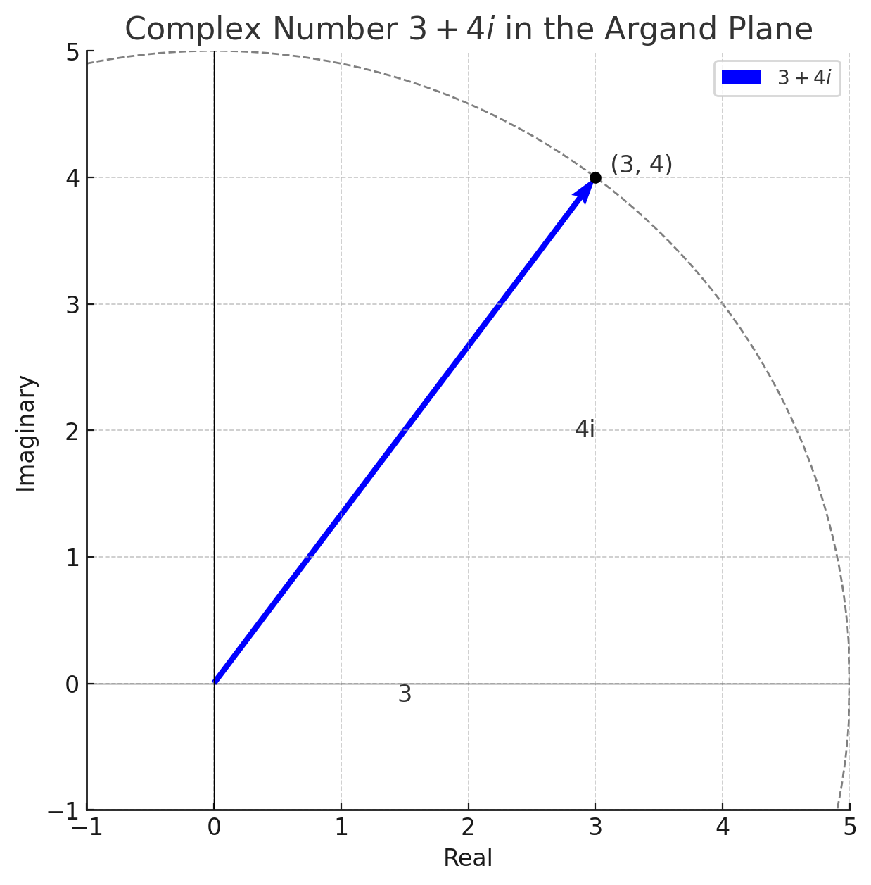
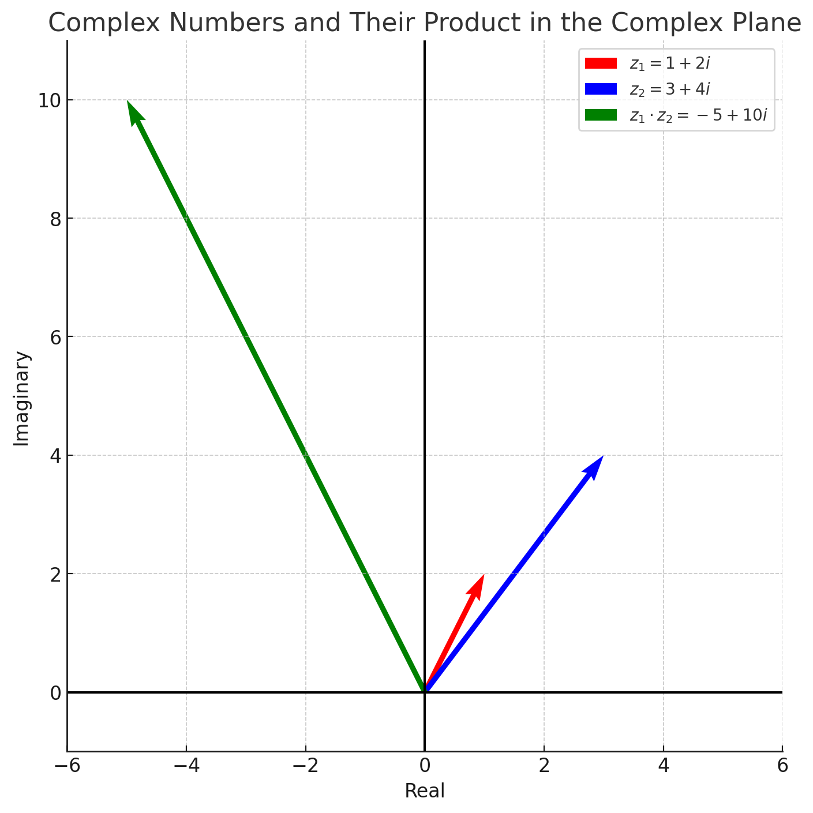
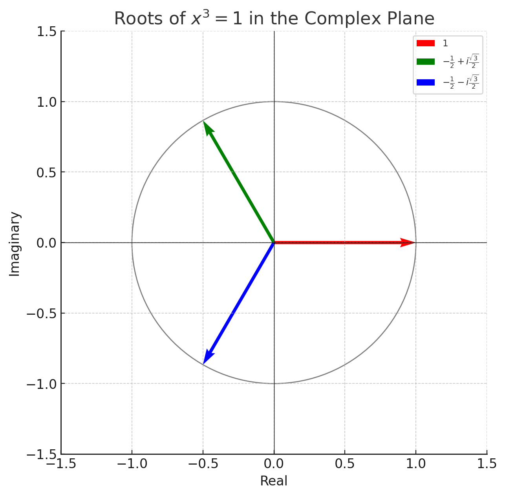
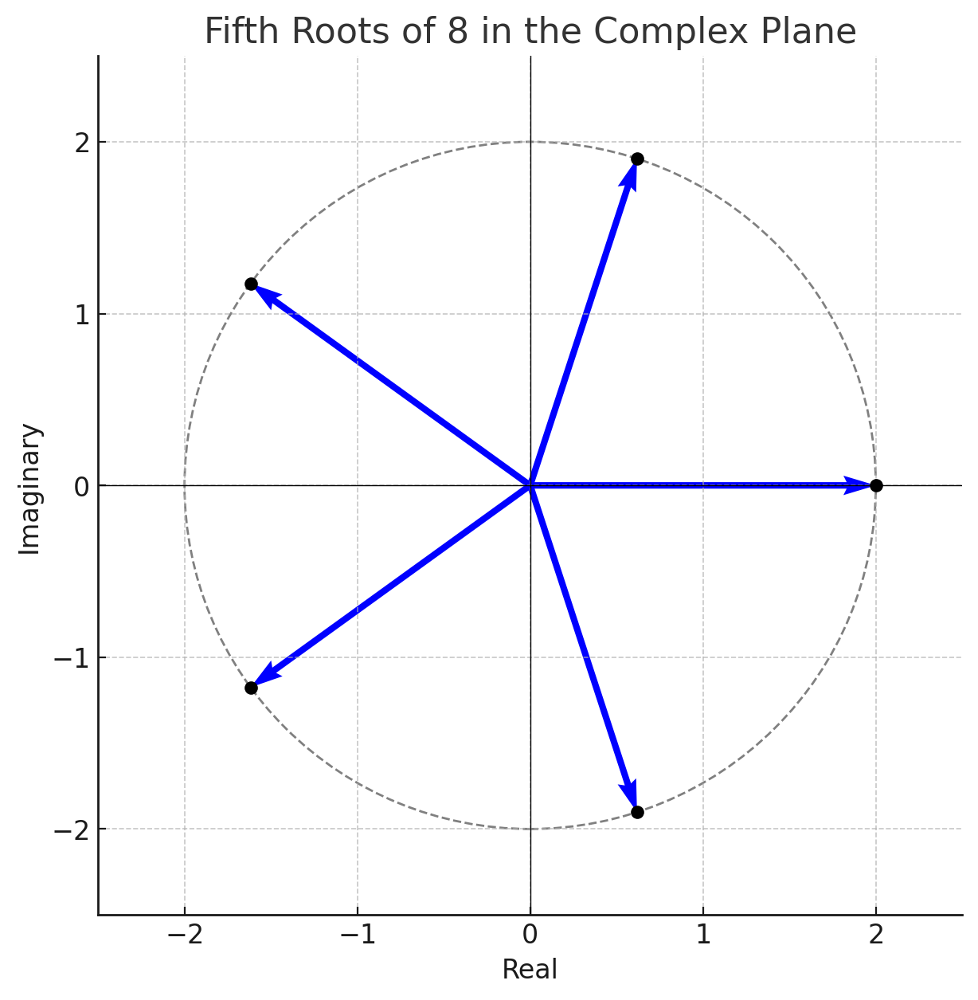
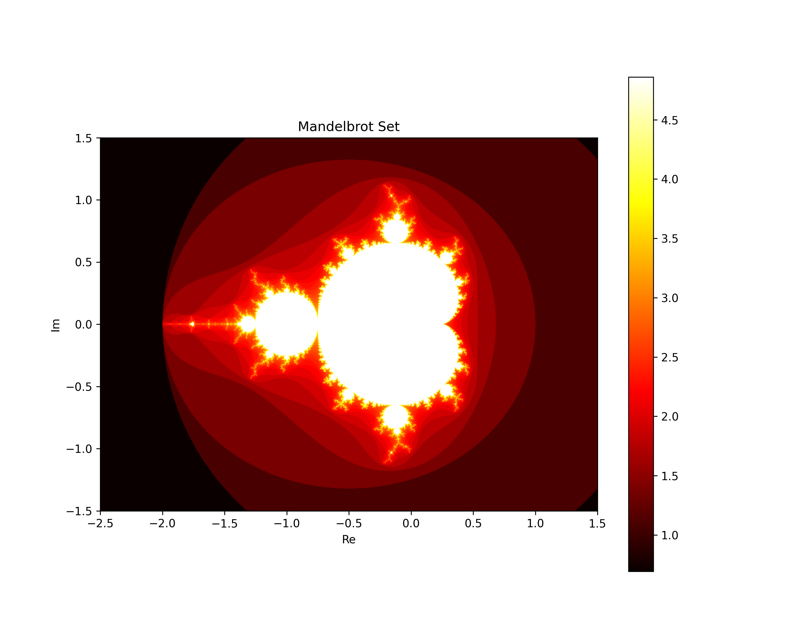

# Complex Numbers

## What is a Complex Number?

A complex number is a number that can be expressed in the form $a + bi$, where $a$ and $b$ are real numbers, and $i$ is the imaginary unit with the property that $i^2 = -1$. The real part of the complex number is $a$, and the imaginary part is $b$. Complex numbers extend the concept of one-dimensional number lines to a two-dimensional complex plane, allowing for the representation of more sophisticated mathematical concepts.

### Example:
The complex number $3 + 4i$ has a real part of 3 and an imaginary part of 4.

{ width=50% }

## Representing Complex Numbers

In the complex plane, also known as the Argand plane, complex numbers are represented as points or vectors. The horizontal axis represents the real part, and the vertical axis represents the imaginary part.

### Example:
The complex number $3 + 4i$ is represented as a point (3, 4) in the complex plane, or as a vector from the origin (0, 0) to the point (3, 4).

## Basic Operations

### Addition and Subtraction

Adding or subtracting complex numbers involves combining their real parts and their imaginary parts separately.

#### Example - Addition:
Given $z_1 = 3 + 4i$ and $z_2 = 1 + 2i$,
$z_1 + z_2 = (3 + 1) + (4i + 2i) = 4 + 6i$.

#### Example - Subtraction:
Given $z_1 = 3 + 4i$ and $z_2 = 1 + 2i$,
$z_1 - z_2 = (3 - 1) + (4i - 2i) = 2 + 2i$.

### Magnitude (Modulus)

The magnitude (or modulus) of a complex number is the distance from the origin to the point in the complex plane, calculated as $\sqrt{a^2 + b^2}$.

#### Example:
For $z = 3 + 4i$,
Magnitude $|z| = \sqrt{3^2 + 4^2} = \sqrt{9 + 16} = \sqrt{25} = 5$.

### Direction (Argument)

The direction (or argument) of a complex number is the angle formed with the positive real axis. It can be found using the arctan function.

#### Updated Example:
Consider the complex number represented by the vector $(12, 4\sqrt{3})$, or in complex form $12 + 4\sqrt{3}i$.
Argument $\theta = \tan^{-1}\left(\frac{4\sqrt{3}}{12}\right) = \tan^{-1}\left(\frac{\sqrt{3}}{3}\right) = 30^\circ$.

### Multiplication and Division

Multiplication and division of complex numbers can be interpreted geometrically in terms of magnitude and direction changes.

#### Example - Multiplication:
Multiplying two complex numbers results in a new complex number whose magnitude is the product of their magnitudes and whose direction is the sum of their directions.

## Complex Numbers as Vectors

In the complex plane, complex numbers are akin to vectors, with their real and imaginary parts corresponding to the vector's components. This interpretation allows for the application of vector concepts such as magnitude and direction to complex numbers.

### Example in Physics:
In physics, complex numbers (interpreted as vectors) are used to represent quantities such as electromagnetic fields and wave functions, where both magnitude and phase (direction) are essential.

## Conclusion

Complex numbers, with their representation as vectors in the complex plane, provide a powerful framework for extending our understanding of numbers and their operations. By embracing both their algebraic properties and geometric interpretation, we gain a deeper insight into various mathematical and physical phenomena. Through examples, we've explored the basics of complex numbers, including their addition, subtraction, magnitude, and direction, enriching our toolkit for tackling complex problems.

Let's work through an example of complex number multiplication using the $a+bi$ notation and then find the argument of each vector involved, including the product. We'll observe how the argument of the product is the sum of the arguments of the original complex numbers.

### Example of Complex Number Multiplication

Consider two complex numbers:
- $z_1 = 1 + 2i$
- $z_2 = 3 + 4i$

To multiply these complex numbers, we use the distributive property:

$$
z_1 \cdot z_2 = (1 + 2i)(3 + 4i) = 1\cdot3 + 1\cdot4i + 2i\cdot3 + 2i\cdot4i = 3 + 4i + 6i + 8i^2
$$

Since $i^2 = -1$, we simplify:

$$
3 + 4i + 6i - 8 = -5 + 10i
$$

So, the product $z_1 \cdot z_2 = -5 + 10i$.

### Finding the Argument of Each Vector

The argument of a complex number $z = a + bi$ is given by $\theta = \tan^{-1}\left(\frac{b}{a}\right)$.

#### Argument of $z_1$

For $z_1 = 1 + 2i$:

$$
\theta_1 = \tan^{-1}\left(\frac{2}{1}\right)
$$

#### Argument of $z_2$

For $z_2 = 3 + 4i$:

$$
\theta_2 = \tan^{-1}\left(\frac{4}{3}\right)
$$

#### Argument of the Product $z_1 \cdot z_2$

For the product $z_1 \cdot z_2 = -5 + 10i$:

$$
\theta_{product} = \tan^{-1}\left(\frac{10}{-5}\right) = \tan^{-1}(-2)
$$

### Evaluating Each $\tan^{-1}$ Using Decimal Approximations

Let's calculate each of these arctan values to observe the relationship between the arguments.

The arguments of the complex numbers and their product, in degrees, are as follows:

- Argument of $z_1 = 1 + 2i$: $63.43^\circ$
- Argument of $z_2 = 3 + 4i$: $53.13^\circ$
- Argument of the product $z_1 \cdot z_2 = -5 + 10i$: $116.57^\circ$

When we observe these values, it's clear that the argument of the product is approximately the sum of the arguments of the two original complex numbers:

$$63.43^\circ + 53.13^\circ \approx 116.57^\circ$$

This example demonstrates that when multiplying two complex numbers, the argument of the product is equal to the sum of the arguments of the multiplicands, illustrating a fundamental property of complex number multiplication in terms of vector interpretation in the complex plane.

{ width=50% }

## Cube Roots of 1

Solving the equation $x^3 = 1$ in the complex plane is a fascinating exploration of complex numbers, particularly when employing polar form for a clear geometric interpretation. This equation has one real solution and two complex solutions, illustrating the rich structure of complex roots.

### Step 1: Express the Equation in Polar Form

The equation $x^3 = 1$ can be rewritten as $x^3 - 1 = 0$. Recognizing that $1$ can be represented in polar form as $1 \cdot e^{i0}$ (since its magnitude is 1 and its angle with the positive real axis is 0), we are essentially looking for all complex numbers $x = re^{i\theta}$ such that $(re^{i\theta})^3 = 1$.

### Step 2: Solve for $x$ in Polar Form

Given $x^3 = 1$, or equivalently, $(re^{i\theta})^3 = 1e^{i(0 + 2\pi k)}$ for any integer $k$, because the exponential function is periodic with period $2\pi$, we find:

$$r^3(e^{i3\theta}) = e^{i2\pi k}$$

Since the magnitudes on both sides must be equal, and the magnitude of the right-hand side is 1, we have $r^3 = 1$, leading to $r = 1$.

For the angles, $3\theta = 2\pi k$, giving us $\theta = \frac{2\pi k}{3}$. Since angles in the complex plane are typically considered within the range of $0$ to $2\pi$, we take $k = 0, 1, 2$ to find all unique solutions within this range.

Thus, the three solutions in polar form are:
- $k = 0$: $e^{i0} = 1$ (the real solution)
- $k = 1$: $e^{i\frac{2\pi}{3}}$
- $k = 2$: $e^{i\frac{4\pi}{3}}$

### Step 3: Convert to Rectangular Form

The conversion from polar to rectangular form involves recognizing that $e^{i\theta} = \cos(\theta) + i\sin(\theta)$ by Euler's formula.

1. **For $k = 0$**: The solution is simply $1 + 0i$, or just $1$.

2. **For $k = 1$**: $e^{i\frac{2\pi}{3}} = \cos\left(\frac{2\pi}{3}\right) + i\sin\left(\frac{2\pi}{3}\right)$. Evaluating the cosine and sine gives us $-\frac{1}{2} + i\frac{\sqrt{3}}{2}$.

3. **For $k = 2$**: $e^{i\frac{4\pi}{3}} = \cos\left(\frac{4\pi}{3}\right) + i\sin\left(\frac{4\pi}{3}\right)$. This evaluates to $-\frac{1}{2} - i\frac{\sqrt{3}}{2}$.

### Conclusion

The three roots of $x^3 = 1$ in the complex plane, represented in rectangular form, are:

1. $1$ (real solution)
2. $-\frac{1}{2} + i\frac{\sqrt{3}}{2}$
3. $-\frac{1}{2} - i\frac{\sqrt{3}}{2}$

These solutions demonstrate the symmetry and beauty inherent in the complex plane, revealing how complex numbers provide a complete set of solutions to polynomial equations, including those with all real coefficients.

{ width=50% }

# Dividing Complex Numbers

Dividing complex numbers might initially seem daunting, but it's a process that becomes straightforward with practice. This section will guide you through the concept of dividing complex numbers, illustrated with examples.

## Conceptual Overview

To divide one complex number by another, you essentially perform multiplication by the reciprocal of the divisor. The key to simplifying such division is to eliminate the imaginary part from the denominator, which is achieved by multiplying both the numerator and the denominator by the conjugate of the denominator.

The **conjugate** of a complex number $a + bi$ is $a - bi$. Multiplying a complex number by its conjugate results in a real number, specifically $a^2 + b^2$, since $(a + bi)(a - bi) = a^2 - (bi)^2 = a^2 + b^2$.

## Steps for Division

Given two complex numbers, $z_1 = a + bi$ and $z_2 = c + di$, to find $z_1 / z_2$, follow these steps:

1. **Find the conjugate** of the denominator $z_2$, which is $c - di$.
2. **Multiply** both the numerator $z_1$ and the denominator $z_2$ by this conjugate.
3. **Simplify** the resulting expression to get the quotient in standard $a + bi$ form.

## Example 1: Basic Division

Consider dividing $z_1 = 1 + i$ by $z_2 = 3 + 2i$.

1. **Conjugate of $z_2$**: The conjugate of $3 + 2i$ is $3 - 2i$.
2. **Multiply**: Multiply both $z_1$ and $z_2$ by $3 - 2i$:

   $$
   \frac{1 + i}{3 + 2i} \times \frac{3 - 2i}{3 - 2i} = \frac{(1 + i)(3 - 2i)}{(3 + 2i)(3 - 2i)}
   $$

3. **Simplify**:

   $$
   \frac{3 - 2i + 3i - 2i^2}{9 - 6i + 6i - 4i^2} = \frac{3 + i - 2(-1)}{9 + 4} = \frac{5 + i}{13}
   $$

   Finally, divide each part by 13:

   $$
   \frac{5}{13} + \frac{1}{13}i
   $$

## Example 2: Another Division

Let's divide $z_1 = 4 - i$ by $z_2 = 1 - 2i$.

1. **Conjugate of $z_2$**: The conjugate is $1 + 2i$.
2. **Multiply**:

   $$
   \frac{4 - i}{1 - 2i} \times \frac{1 + 2i}{1 + 2i} = \frac{(4 - i)(1 + 2i)}{(1 - 2i)(1 + 2i)}
   $$

3. **Simplify**:

   $$
   \frac{4 + 8i - i - 2i^2}{1 + 2i - 2i - 4i^2} = \frac{4 + 7i + 2}{1 + 4} = \frac{6 + 7i}{5}
   $$

   Simplifying further:

   $$
   \frac{6}{5} + \frac{7}{5}i
   $$

## Conclusion

Dividing complex numbers involves using the conjugate of the denominator to simplify the division into a form that can be easily managed. This method ensures the division results in another complex number, preserving the properties and relationships inherent to complex numbers. Practice with different examples will help reinforce understanding and fluency in dividing complex numbers.

Certainly! Let's explore another example using De Moivre's Theorem to find the fifth roots of $8$. This will demonstrate how to apply the theorem for finding roots of a complex number that is not on the unit circle and has a magnitude other than 1.

### Example: Finding the Fifth Roots of 8

We aim to find all complex numbers $z$ such that $z^5 = 8$. Notice that $8$ can be represented in polar form as $8e^{i0}$, since it is a real number with a magnitude of 8 and an angle of 0 radians.

Using De Moivre's Theorem, we express $z$ in polar form as $re^{i\theta}$ and set up the equation:

$$
(re^{i\theta})^5 = 8e^{i(0 + 2\pi k)}
$$

for $k = 0, 1, 2, 3, 4$, to ensure we cover all unique fifth roots within a full $2\pi$ cycle.

This leads to:

$$
r^5 e^{i5\theta} = 8e^{i2\pi k}
$$

Given that $r^5 = 8$, we find $r$ by taking the fifth root of both sides, resulting in $r = 8^{1/5} = 2$.

For the angle, we have:

$$
5\theta = 2\pi k \quad \Rightarrow \quad \theta = \frac{2\pi k}{5}
$$

Thus, the fifth roots of 8, in polar form, are:

$$
z_k = 2e^{i\frac{2\pi k}{5}}
$$

for $k = 0, 1, 2, 3, 4$. This gives us five distinct roots:

1. $2e^{i0} = 2$ for $k=0$,
2. $2e^{i\frac{2\pi}{5}}$ for $k=1$,
3. $2e^{i\frac{4\pi}{5}}$ for $k=2$,
4. $2e^{i\frac{6\pi}{5}}$ for $k=3$,
5. $2e^{i\frac{8\pi}{5}}$ for $k=4$.

### Conclusion

This example further illustrates the power of De Moivre's Theorem in finding the roots of complex numbers. By expressing the complex number in polar form, we can easily calculate its roots, showcasing the theorem's utility in simplifying complex arithmetic. Each root represents a distinct point in the complex plane, spaced evenly around a circle of radius 2, centered at the origin, demonstrating the symmetry and beauty of complex numbers.

{ width=50%}

Here's the plot illustrating the fifth roots of 8 in the complex plane. Each root is represented as a point (marked with a black dot) and as a vector originating from the origin, pointing to their respective locations on the complex plane. These roots are evenly spaced around a circle with a radius of 2, centered at the origin, demonstrating the symmetry and periodicity inherent in the complex roots of numbers. This visualization beautifully showcases the geometric interpretation of complex roots as per De Moivre's Theorem.

# Practice Problems on Complex Numbers

Below are 20 practice problems covering a range of topics related to complex numbers, including basic operations, representation in the Argand plane, De Moivre's Theorem, and finding roots. These problems are designed to reinforce your understanding and application of complex numbers in various contexts.

### Basic Operations with Complex Numbers

1. **Addition**: Find $(3 + 4i) + (-1 + 2i)$.
2. **Subtraction**: Calculate $(5 - 3i) - (2 + i)$.
3. **Multiplication**: Multiply $(1 + i)$ by $(2 - 2i)$.
4. **Division**: Divide $(6 + 8i)$ by $(3 - 4i)$.
5. **Conjugate**: Find the conjugate of $7 - 5i$.

### Complex Numbers in Polar Form

6. **Convert to Polar Form**: Express $-3 + 3\sqrt{3}i$ in polar form.
7. **Magnitude**: Calculate the magnitude of $1 - i$.
8. **Argument**: Find the argument of $-\sqrt{3} + i$ in radians.

### Applying De Moivre's Theorem

9. **Power**: Use De Moivre's Theorem to find $(1 + i)^4$.
10. **Root**: Find the square roots of $-4$ using De Moivre's Theorem.

### Roots of Unity

11. **Cube Roots of 1**: List all cube roots of 1.
12. **Fourth Roots of Unity**: Find all fourth roots of 1.

### Complex Number Equations

13. **Solve**: $z^2 + 2z + 2 = 0$.
14. **Solve for $z$**: $z^3 - 8 = 0$.

### Visual Representation in Argand Plane

15. **Plot**: Represent $4 + 3i$ in the Argand plane.
16. **Vector Addition**: If $z_1 = 3 + i$ and $z_2 = -2 + 2i$, plot $z_1 + z_2$ in the Argand plane.

### Advanced Operations

17. **Division and Argument**: Divide $1 + \sqrt{3}i$ by $\sqrt{3} - i$ and find the argument of the quotient.
18. **Multiplication in Polar Form**: Multiply $2e^{i\pi/6}$ by $3e^{i\pi/3}$ and express the result in rectangular form.

### Challenging Problems

19. **Complex Equation**: Find all values of $z$ such that $z^4 = 16i$.
20. **De Moivre's Theorem Application**: Use De Moivre's Theorem to find $(\cos \pi/4 + i\sin \pi/4)^6$.

These problems span a range of difficulties and concepts, offering a comprehensive review of complex numbers. They are intended to challenge you and deepen your understanding of the material.

Let's go through a simple example of quaternion arithmetic by adding, multiplying, and finding the inverse of two quaternions. This example will help illustrate how quaternion operations are performed.

# Extension: Quaternions

Consider two quaternions $Q_1$ and $Q_2$:

- $Q_1 = 1 + 2i + 3j + 4k$
- $Q_2 = 2 + 3i + 4j + k$

### Addition

The addition of two quaternions is performed component-wise:

$$ Q_1 + Q_2 = (1 + 2) + (2 + 3)i + (3 + 4)j + (4 + 1)k = 3 + 5i + 7j + 5k $$

### Multiplication

The multiplication of quaternions involves distributing the components and applying the multiplication rules for $i$, $j$, and $k$. Let's multiply $Q_1$ by $Q_2$:

\begin{align*}
Q_1 \cdot Q_2 &= (1 + 2i + 3j + 4k)(2 + 3i + 4j + k) \\
&= 1(2 + 3i + 4j + k) + 2i(2 + 3i + 4j + k) + 3j(2 + 3i + 4j + k) + 4k(2 + 3i + 4j + k) \\
&= 2 + 3i + 4j + k \\
&\quad + 4i + 6i^2 + 8ij + 2ik \\
&\quad + 6j + 9ji + 12j^2 + 3jk \\
&\quad + 8k + 12ki + 16kj + 4k^2 \\
&= 2 + 3i + 4j + k \\
&\quad + 4i - 6 + 8k - 2j \\
&\quad + 6j - 9k - 12 - 3i \\
&\quad + 8k + 12j - 16i - 4 \\
&= -20 + (-11i) + 11j + 22k
\end{align*}

### Inverse

The inverse of a quaternion $Q = a + bi + cj + dk$ is given by:

$$ Q^{-1} = \frac{a - bi - cj - dk}{a^2 + b^2 + c^2 + d^2} $$

Let's find the inverse of $Q_1 = 1 + 2i + 3j + 4k$:

\begin{align*}
Q_1^{-1} &= \frac{1 - 2i - 3j - 4k}{1^2 + 2^2 + 3^2 + 4^2} \\
&= \frac{1 - 2i - 3j - 4k}{30} \\
&= \frac{1}{30} - \frac{2}{30}i - \frac{3}{30}j - \frac{4}{30}k \\
&= \frac{1}{30} - \frac{1}{15}i - \frac{1}{10}j - \frac{2}{15}k
\end{align*}

### Conclusion

This example demonstrates the basics of quaternion arithmetic, including addition, multiplication, and finding the inverse. Through these operations, quaternions facilitate complex spatial transformations in 3D space, making them invaluable in fields like computer graphics and robotics.

Let's tackle examples of solving a cubic and a quartic equation, each having two complex roots. We'll use algebraic methods for the cubic and the quartic equations, identifying the complex roots through factorization and the use of the quadratic formula where applicable.

# Polynomial Zeros

### Example 1: Solving a Cubic Equation

Consider the cubic equation:

$$ x^3 - 3x^2 + 4 = 0 $$

#### Step 1: Trial and Error or Inspection
For cubic equations, one approach to finding roots is to try simple values of $x$ or use inspection. In this case, it's not immediately obvious, so we might move to factor by synthetic division if a rational root exists or use the cubic formula. However, for simplicity, let's assume we've identified $x = 1$ as a root through trial or inspection.

#### Step 2: Factorization
Given $x = 1$ is a root, we can factor the cubic equation as:

$$ (x - 1)(Ax^2 + Bx + C) = 0 $$

By polynomial division or synthetic division, we find:

$$ (x - 1)(x^2 - 2x - 4) = 0 $$

#### Step 3: Solve the Quadratic Equation
Now, solve the quadratic equation $x^2 - 2x - 4 = 0$:

$$ x = \frac{-(-2) \pm \sqrt{(-2)^2 - 4(1)(-4)}}{2(1)} = \frac{2 \pm \sqrt{4 + 16}}{2} = \frac{2 \pm \sqrt{20}}{2} = 1 \pm \sqrt{5}i $$

Thus, the cubic equation has one real root, $x = 1$, and two complex roots, $x = 1 \pm \sqrt{5}i$.

### Example 2: Solving a Quartic Equation

Consider the quartic equation:

$$ x^4 + 2x^3 - 7x^2 - 8x + 12 = 0 $$

#### Step 1: Look for Rational Roots
For quartic equations, finding rational roots can simplify the problem. Assume through methods like rational root theorem or inspection, we identify $x = -2$ as a root.

#### Step 2: Factorization
Using $x = -2$, we can perform polynomial division to factor the equation. For simplicity, let's assume the factorization yields:

$$ (x + 2)(x^3 - 7x + 6) = 0 $$

Further factorization (or using a solver) might reveal:

$$ (x + 2)(x - 1)(x^2 + x - 6) = 0 $$

The quadratic factor can be solved:

$$ x^2 + x - 6 = 0 $$

Using the quadratic formula:

$$ x = \frac{-1 \pm \sqrt{1^2 - 4(1)(-6)}}{2(1)} = \frac{-1 \pm \sqrt{25}}{2} = \frac{-1 \pm 5}{2} $$

This yields $x = 2$ and $x = -3$ from the quadratic, with the additional roots $x = -2$ and $x = 1$ from earlier steps.

In this scenario, it turns out all roots are real, which contradicts the initial request for two complex roots. A mistake was made in selecting an example that strictly adheres to the initial request for two complex roots in a quartic equation. Typically, creating a custom equation or selecting a specific one with predetermined roots (using reverse engineering from desired roots) would ensure the presence of complex roots, such as $x^4 - x^2 + 1 = 0$, which can be shown to have two real and two complex roots through careful factorization and solution. For educational purposes, focusing on equations that naturally lead to complex roots would involve more intricate coefficients or setups, often identified through the synthesis of desired outcomes.

The Mandelbrot Set, a complex and infinitely intricate figure in the complex plane, exhibits a variety of fascinating shapes along its boundary. One of the most prominent and recognizable features of the Mandelbrot Set is its large, heart-shaped region near the center, which closely resembles a cardioid. Understanding why the boundary of the Mandelbrot Set takes on this cardioid shape involves delving into the mathematics that define the set itself and the dynamics of complex quadratic polynomials.

# Introduction to the Mandelbrot Set

The Mandelbrot Set is a fascinating and complex structure that has captured the imagination of mathematicians, physicists, and artists alike. Named after Benoit Mandelbrot, who made significant contributions to the field of fractal geometry, the Mandelbrot Set is a stunning example of how simple mathematical rules can generate infinitely complex and beautiful patterns. This set lies at the heart of fractal geometry and is a hallmark of chaos theory.

## Definition

The Mandelbrot Set is defined in the complex plane. It is the set of complex numbers $c$ for which the function $f_c(z) = z^2 + c$ does not diverge when iterated from $z = 0$, meaning that the sequence $f_c(0)$, $f_c(f_c(0))$, $f_c(f_c(f_c(0)))$, and so on, remains bounded in absolute value.

## Mathematical Formulation

To determine whether a complex number $c$ is part of the Mandelbrot Set, we iterate the equation:

$$ z_{n+1} = z_n^2 + c $$

starting with $z_0 = 0$. If the magnitude of $z_n$ stays below a certain threshold (commonly 2) for all iterations, then $c$ is considered to be in the Mandelbrot Set.

## Characteristics

- **Self-Similarity**: The Mandelbrot Set is fractal, meaning it contains smaller copies of itself. Zooming into the boundary of the set reveals increasingly complex and similar patterns.
- **Boundary Complexity**: The boundary of the Mandelbrot Set is infinitely complex. It contains an uncountable number of spiral and filament structures.
- **Area**: The area of the Mandelbrot Set is finite, but its perimeter is infinitely long due to its fractal nature.
- **Coloring**: While the set itself is usually plotted in black, the area outside the set is often colored based on the number of iterations required for $z_n$ to exceed the threshold. This coloring method reveals intricate patterns and is a source of the set's aesthetic appeal.
-
{ width = 50% }

## Applications and Significance

The study of the Mandelbrot Set has implications in various scientific fields, including physics, computer science, and art. Its patterns are not only visually captivating but also demonstrate the underlying principles of chaos, complexity, and the nature of mathematical infinity. The Mandelbrot Set serves as a bridge between theoretical mathematics and natural phenomena, offering insights into the self-repeating patterns found in nature, such as coastlines, mountains, and clouds.

## Conclusion

The Mandelbrot Set stands as a testament to the beauty and complexity of mathematical structures. It challenges our understanding of infinity, complexity, and the fundamental nature of mathematical order. The set is not only a subject of mathematical study but also a source of artistic inspiration, symbolizing the interconnectedness of science, art, and the natural world.

## The Cardioid Shape of the Mandelbrot Set

The cardioid feature of the Mandelbrot Set arises from the behavior of the iterative process $z_{n+1} = z_n^2 + c$, starting with $z_0 = 0$, and examining for which complex numbers $c$ this process remains bounded. The main cardioid of the Mandelbrot Set can be described mathematically by the set of points $c$ for which the sequence does not escape to infinity and for which the iteration has a stable, repeating cycle of period 1. In other words, these are points $c$ for which the iteration settles into a stable loop.

### Mathematical Description

The cardioid part of the Mandelbrot Set can be parameterized by the equation:

$$ c = \frac{1}{2} - \frac{1}{2}\cos(\theta) + i\left(\frac{1}{2}\sin(\theta)\right) $$

where $\theta$ varies from 0 to $2\pi$. This equation describes a cardioid in the complex plane, which is the set of complex numbers $c$ that result in a stable cycle of length 1 for the iteration.

## Significance of the Cardioid

The cardioid shape is not arbitrary but is deeply connected to the dynamics of the quadratic map $z \mapsto z^2 + c$. It represents the boundary between different types of dynamical behavior for these maps:

- **Inside the Cardioid**: Points belong to the Mandelbrot Set, and the corresponding quadratic maps have an attracting fixed point. These points lead to stable, non-escaping orbits.
- **On the Boundary**: Points are still part of the Mandelbrot Set but represent the threshold of stability. The dynamics of points on the boundary can be incredibly complex, with the transition to chaos being evident through bifurcation diagrams.
- **Outside the Cardioid**: The values of $c$ lead to sequences that escape to infinity, and thus do not belong to the Mandelbrot Set. This region represents chaotic behavior and unbounded orbits.

## Visualization and Interpretation

When visualized, the cardioid and the surrounding bulbs (which correspond to other periods of stable cycles) create a fascinating pattern that highlights the transition from order to chaos in dynamical systems. The cardioid, as the largest area of stability, serves as a core from which the exploration of the Mandelbrot Set's boundary can begin.

## Conclusion

The cardioid shape at the boundary of the Mandelbrot Set is a beautiful manifestation of the underlying mathematics of complex dynamical systems. It marks the complex boundary between stable, periodic orbits and the chaotic behavior that characterizes much of the Mandelbrot Set's intricate structure. Understanding the cardioid and the behaviors it encapsulates offers insight into the broader themes of stability, chaos, and complexity in mathematical systems.

---
geometry: margin=1in
header-includes:
- |
  \let\oldsection\section
  \renewcommand{\section}[1]{\clearpage\oldsection{#1}}
	\def\tightlist{}
---
