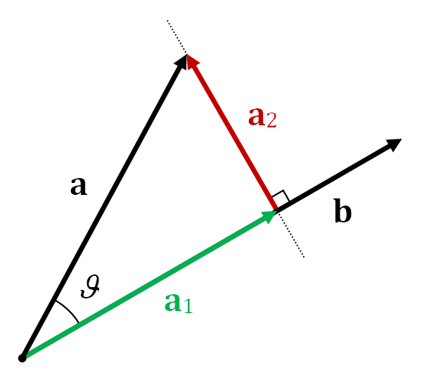

# Applications of Vectors

First we include 2 incredibly important vector applications, the dot product and the cross product. Following this are a number of problems.

### Dot Product (Scalar Product)

- **Definition**: The dot product between two vectors $\vec{a}$ and $\vec{b}$ is a scalar quantity that is the result of multiplying the magnitudes of the two vectors by the cosine of the angle ($\theta$) between them. It is denoted as $\vec{a} \cdot \vec{b}$.
- **Formula**: $\vec{a} \cdot \vec{b} = \|\vec{a}\| \|\vec{b}\| \cos(\theta)$ where $|\vec{a}|$ and $|\vec{b}|$ are the magnitudes of vectors $\vec{a}$ and $\vec{b}$, respectively.
- **Component-wise Calculation**: For vectors in 2D  Cartesian coordinates, $\vec{a} = (a_x, a_y)$ and $\vec{b} = (b_x, b_y)$, the dot product is $\vec{a} \cdot \vec{b} = a_xb_x + a_yb_y$. In 3D Cartesian coordinates, $\vec{a} = (a_x, a_y, a_z)$ and $\vec{b} = (b_x, b_y, b_z)$, the dot product is $\vec{a} \cdot \vec{b} = a_xb_x + a_yb_y + a_zb_z$. In any dimension, the dot product is simply the sum of the component-wise products of the 2 vectors.
- **Properties**:
  - Commutative: $\vec{a} \cdot \vec{b} = \vec{b} \cdot \vec{a}$
  - Distributive (over $+$): $\vec{a} \cdot (\vec{b} + \vec{c}) = \vec{a} \cdot \vec{b} + \vec{a} \cdot \vec{c}$
  - Scalar Result: The result is a scalar (not a vector).
  - $\vec{a} \cdot \vec{b} \cdot \vec{c}$ is not defined since the dot product is a scalar.
- **Applications**: Dot product is used to find the angle between two vectors, project one vector onto another, and in various physics calculations like work. One handy application is that $\vec{a}$ and $\vec{b}$ are perpendicular if and only if their dot product is 0. Another is that $\|\vec{a}\|^2 = \vec{a} \cdot \vec{a}$. In word, the dot product of a vector with itself is its squared magnitude.

### Cross Product (Vector Product)

- **Definition**: The cross product between two 3D vectors $\vec{a}$ and $\vec{b}$ is a vector that is perpendicular to the plane containing $\vec{a}$ and $\vec{b}$. It is denoted as $\vec{a} \times \vec{b}$. It is only defined in three dimensions.
- **Formula**: $\vec{a} \times \vec{b} = \|\vec{a}\| \|\vec{b}\| \sin(\theta) \vec{n}$, where $\theta$ is the angle between $\vec{a}$ and $\vec{b}$, and $\vec{n}$ is a unit vector perpendicular to the plane containing $\vec{a}$ and $\vec{b}$.
- **Component-wise Calculation**: For vectors in Cartesian coordinates, $\vec{a} = (a_x, a_y, a_z)$ and $\vec{b} = (b_x, b_y, b_z)$, the cross product is $\vec{a} \times \vec{b} = (a_yb_z - a_zb_y, a_zb_x - a_xb_z, a_xb_y - a_yb_x)$.
- **Properties**:
  - Commutative: ? (TBD)
  - Distributive: $\vec{a} \times (\vec{b} + \vec{c}) = \vec{a} \times \vec{b} + \vec{a} \times \vec{c}$
  - Vector Result: The result is a vector.
- **Applications**: The main application is to find a vector perpendicular to 2 given vectors. Cross product can also be used to find the area of a parallelogram formed by two vectors, and in physics to compute torque, and the relationship between electric and magnetic fields.

### Practice Problems
  1. Given vectors $\vec{a} = (3, -4, 1)$ and $\vec{b} = (2, 5, -3)$, find the dot product $\vec{a} \cdot \vec{b}$.

  1. Given vectors $\vec{a} = (1, 0, 1)$ and $\vec{b} = (0, 1, 1)$, find the angle between $\vec{a}$ and $\vec{b}$.

  1. Given vectors $\vec{a} = (2, 3, -1)$ and $\vec{b} = (-4, 2, 2)$, determine if $\vec{a}$ and $\vec{b}$ are perpendicular.

  4.  (*) Given vector $\vec{a} = (4, -1)$, find a vector $\vec{b}$ that is in the xy-plane and makes a $60^\circ$ angle with $\vec{a}$.

  5.  Let $\vec{a}$ be any 2D vector $\langle x,y \rangle$ in the plane and let $\vec{b} = \langle
  x\cos\theta - y\sin\theta,
  x \sin\theta +  y \cos\theta \rangle$
  prove that the angle between $\vec{a}$ and $\vec{b}$ is $\theta$.

  1. (*) Use the result of the previous problem to prove the addition law of cosines.
  2. Rewrite $\vec{b} = \langle
  x\cos\theta - y\sin\theta,
  x \sin\theta +  y \cos\theta \rangle$ as a $2\times2$ matrix times a $2\times1$ vector.

  3. Given vectors $\vec{a} = (1, 2, 3)$ and $\vec{b} = (4, 5, 6)$, find the cross product $\vec{a} \times \vec{b}$.

  12. The cross product can be defined as a matrix determinant. Look up the formula and write it down.

  4. Given vectors $\vec{a} = (1, -2, 1)$ and $\vec{b} = (-2, 4, -2)$, determine if $\vec{a}$ and $\vec{b}$ are parallel by using the cross product.

  5. Given vectors $\vec{a} = (3, -3, 1)$ and $\vec{b} = (2, -1, 1)$, find the area of the parallelogram spanned by $\vec{a}$ and $\vec{b}$.

  6. Given vectors $\vec{a} = (1, 2, 3)$ and $\vec{b} = (-1, 0, 1)$, find the area of the triangle formed by $\vec{a}$, $\vec{b}$, and the origin.
  7. Use vectors to find the area of the triangle with vertices at $(3,5), (-2,1)$ and (6,-4)$
  8.  Pick two vectors $\vec{a}$ and $\vec{b}$ and describe the relationship between $\vec{a} \times \vec{b}$ and $\vec{b} \times \vec{a}$.
  9.  What is $c_1\vec{a} \cdot c_2 \vec{b}$?
  10. What is $c_1\vec{a} \times c_2 \vec{b}$?
  11. What is $c_1\vec{a} \cdot c_1 \vec{a}$?
  13. (*) Write $\vec{x}$ as a Linear Combination of $\vec{a}$, $\vec{b}$, $\vec{c}$. Given the three 3D vectors $\vec{a}$, $\vec{b}$, and $\vec{c}$ defined as follows:
      - $\vec{a} = (2, -1, 3)$
      - $\vec{b} = (0, 1, -1)$
      - $\vec{c} = (-1, 0, 2)$

      And given vector $\vec{x} = (3, 2, -1)$,
    write $\vec{x}$ as a linear combination of vectors $\vec{a}$, $\vec{b}$, and $\vec{c}$. In other words, find scalars $k$, $l$, and $m$ such that: $\vec{x} = k\vec{a} + l\vec{b} + m\vec{c}$.
  (hint:) Use matrices (and your calculator is helpful!).

  1.   Explain geometrically when a problem like 18 can't be solved.
  2.   Explain algebraically when a problem like 18 can't be solved.
  3.   Find a vector parallel to the line $ax + by + c = 0$ and a vector perpendicular to the line $ax + by + c = 0$

  14.   (**) To find the distance $d$ from a point $(x_1, y_1)$ to a line defined by the equation $ax + by + c = 0$, you can use the following formula:

  $$ d = \frac{|ax_1 + by_1 + c|}{\sqrt{a^2 + b^2}} $$

Prove this formula using dot products. (It is helpful to write a line as the set of points $\vec{a} + \lambda \vec{b}$ for any real constant $\lambda$.)

5. The projection of $\vec{a}$ onto $\vec{b}$ is shown in the diagram on the right as the vector $\vec{a_1}$. Derive a formula for $\vec{a_1} = \textit{proj}_{\textbf{b}}\textbf{a}$.
{ width=25% }
  1.  A boat wishes sail due east across a north-south flowing river. The river current is moving 20 knots at an angle of 10 degrees east of north while and the wind is blowing 15 knots towards an angle of 25 degrees north of west. Which bearing and what engine speed should the boat maintain to achieve its heading while traveling at a speed of 18 knots?

  2. A boat is being pulled by three tugboats. Tugboat A is pulling with a force of 100 Newtons directly north. Tugboat B is pulling with a force of 50 Newtons at an angle of 30° to the east of north. Tugboat C is pulling with a force of 75 Newtons at an angle of 45° to the west of north. Calculate the magnitude and direction of the resultant force acting on the boat.
