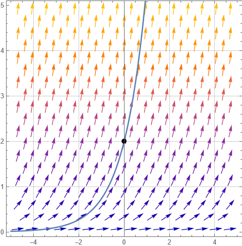
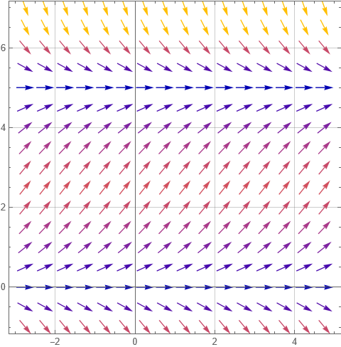
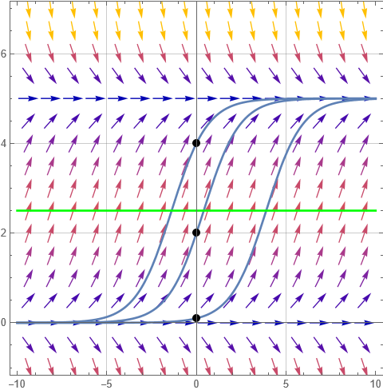

# Logistic Growth

Differential equations (which model a function based on the rate of change of the function) are commonly used to model populations, because population growth *rates* are usually dependent, at least in part, on the population *size* at any time.

We will review a simplistic growth model, the exponential model, and next introduce an extension of the exponential model call the logistic growth model.

In the following we will assume time $t$ is an independent parameter, the population $y(t)$ is dependent only on time and certain constants. Population must be non-negative, but time can be positive or negative, with negative time simply indicating a time before the, often arbitrary, initial $t=0$.

## Exponential Growth

If one cell splits into two cells, then four, then eight, without bound, we have a simple growth model: the number of new cells in a given time interval equals the number of current cells. Extended to a differential equation

$$\dfrac{dy}{dt} = ky(t)$$

is an exponential growth model with growth constant $k$. This equation can be solved using separation of variables

$$y(t) = Ce^{kt}$$

where $y(0) = C$ is the initial population. 

{ width=50% }

The above plot shows a slope field and its particular solution with initial population $y(0) = 2$. The solution, $y(t) = 2e^t$ exhibits unbounded exponential growth. These models work well in some cases over a limited time span. Yet all such models eventually break down because unlimited growth will always meet some impediment.

## Logistic Growth

One simple impediment we can add to the equation is an upper bound on the population. If the growth rate starts out as an exponential but then slows down as the population reaches a maximum value, how can we model this mathematically?

Start by considering the asymptotes of $y'=ky$. The equation $y'=0$ tells us when this slope field has an asymptote. $y'=0 \rightarrow ky = 0 \rightarrow y=0$. The limiting population of exponential growth is simply $y(t) = 0$ -- the lower bound. How can we add an upper bound?

Consider the equation $y' = ky(L-y)$ Solving $y'=0$ now has two solutions, $y(t) = 0$ and $y(t) = L$. The population would have asymptotic limits at these two values, 0 a minimum and $L$ a maximum. Additionally, if $0 < y < L$ then $y' > 0$, so the growth rate is positive. If $y>L$ then $y'<0$ and the growth rate is negative. As $y$ approaches $L$, the growth rate approaches 0. The slope field for $y' =0.1y(5-y)$ is shown below

{ width=50% }

The logistic differential equation can also be solved by separation of variables. First (for no reason other than convention), the equation is rewritten

$$ \dfrac{dy}{dt} = ky(1 - y/L)$$

(This equation still has the same zeros at $y=0$ and $y=L$ but $k$ will 
be different. This doesn't matter since $k$ is an undetermined constant).

The general solution to the above form of the logistic differential equation is

$y(t) = \dfrac{L}{1 + b e^{-kt}}$

You can verify algebraically that as $t \to \infty$, then $y(t) \to L$ and as $t \to -\infty$ (which we allow), then $y(t) \to 0$. In this general solution $b$ is determined by the initial population (or really any fixed starting point $y(t)$ and then $k$ is determined by the growth rate.) 

Graphed below are three particular solutions to the above differential equation, corresponding to three separate initial populations. Notice that in each case, the resulting curves are the same, only shifted in the $t$ dimension.

{ width=50% }

The green line indicated on the graph, at $y=L/2$ is of particular significance. At this population

* the growth rate is maximized (*i.e* the slope is the largest)
* the population has an inflection point (the growth rate changes from increasing to decreasing)
* the value $L/2$ has no dependence on initial conditions!

### Extension: Machine Learning

The logistic curve, though used in Calculus BC to model populations, is by far most often used as an *activation function* in machine learning to approximate a $0-1$ output. Neural networks are comprised of millions of simple "neurons" that take in some input and output either a 0 or a 1. This output is fed into other neurons and eventually the whole network produces an answer (the answer is usually some kind of vector). The problem with outputting a 0 or a 1 is there is no middle ground -- the output function jumps immediately from 0 to 1 (this is called a step function). This jumping behavior makes such a network mathematically impossible to train, specifically because the step function is not differentiable at the point where $f(x)$ jumps from 0 to 1. The logistic function $y = \dfrac{1}{1+e^{-kx}}$ solves this problem because it smoothly transitions from $0$ to $1$ and is differentiable everywhere. The grown rate $k$ determines how quickly it transitions and, as a result, how quickly the model trains.

Additionally, since the logistic function satisfies the differential equation $f'(x) = k f(x)(1-f(x))$, its derivative is essentially free to calculate at $x$ once you have already computed $f(x)$. This "free derivative" speeds up training tremendously! It is not much of an exaggeration to say that without the logistic curve (or other curves with similar properties), neural networks as we know them wouldn't exist.

## Example

(This example is adapted from notes published at https://www.cbsd.org/)

1. Biologists stocked a lake with 400 trout and estimated the carrying capacity (the maximal population of trout in that lake) to be 10,000 . Observation of the trout in the lake revealed that the number of trout tripled in the first year.

    a) Assuming that the size of the trout population satisfies a logistic model, write the differential equation for the model and an expression for the size of the trout population, $y$, after $t$ years. Use your expression and the information given to find the value of the constant $k$.

    *solution:* $y' = ky\left (1-\dfrac{y}{10000} \right )$ and $y(t) = \dfrac{10000}{1+be^{-kt}}$. By using the point $(0,400)$ we can solve for $b = 24$ and then using $(1,1200)$ we find $k = 1.186$ so the population model is $$y(t) = \dfrac{10000}{1+24e^{-1.186t}}$$

    b) What will be the trout population when the rate of growth predicted by the logistic model changes from increasing to decreasing? Explain your answer.

    *solution:* $y=L/2 = 5000$ is the inflection point. It is always at half the carrying capacity.

    c) Find the value of the largest rate of growth for the trout population. Show all your work.

    *solution:* $y'(t) = 1.186y(1-\dfrac{y}{10000})$ and at the population in question, $y = 5000$. This gives $y'(t) = 2964.059$ (note we never need the actual value of $t$ here. We'll solve for it next, though). 

    d) After how many years will the rate of growth of the trout population change from increasing to decreasing? Show all your work.

    *solution:* solve $y(t) = 5000$ and get $t=2.680$

    e) Find $\lim _{t \rightarrow \infty} P(t)$.

    *solution:* 10,000

    f) Set up an equation to find when the trout population will reach 8,000. Use your calculator to solve your equation.

    *solution:* $y(t) = 8000$ which solves to $t=3.850$

    g) Suppose now that instead of stocking the lake with 400 trout, biologists decided to start up with 12,000 trout. Find $\lim _{t \rightarrow \infty} P(t)$. Write a sentence interpreting your answer.

    *solution:* The population decreases towards 10,000 and the limit is still 10,000. We can verify from $y'(t)$ that $y'(t) < 0$ when $y > 10000$

    h) If the initial trout population is 12,000 and the value of the constant $k$ is the same as the one found in $1 \mathrm{a}$ ), find an expression for the size of the trout population, $P$, after $t$ years.

    *solution:* Solve the equation $y(t) = \dfrac{10000}{1+be^{-1.186t}}$ with the initial condition $(0,12000)$ and find $b = -\frac16$
